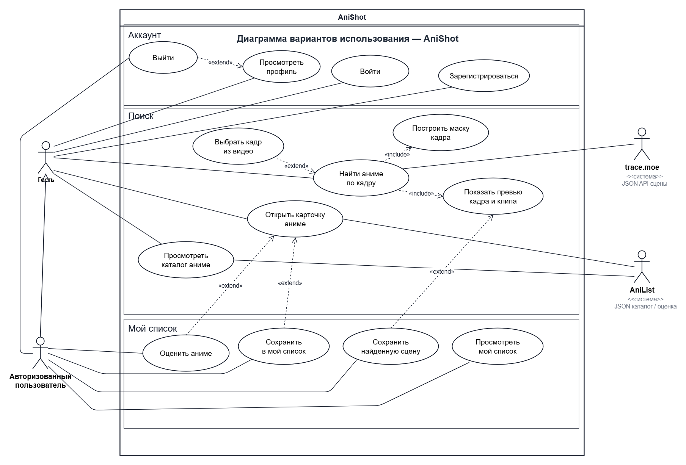
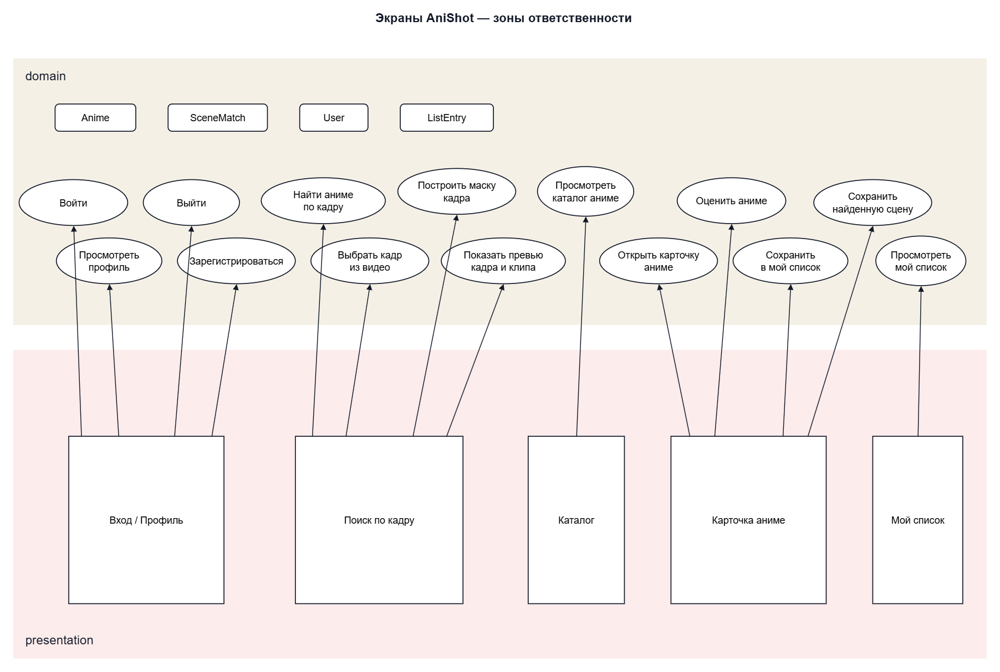
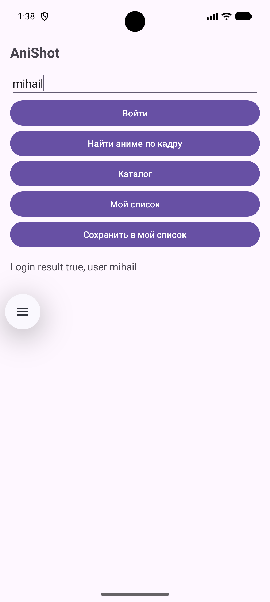
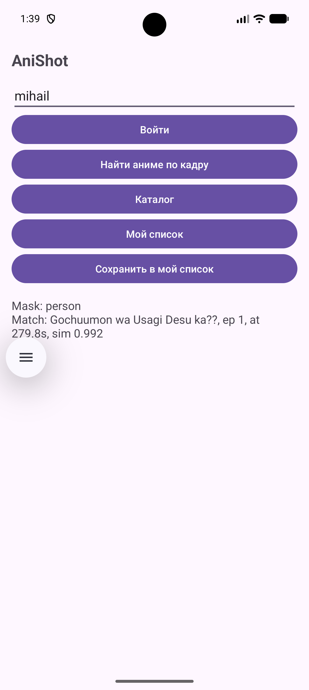
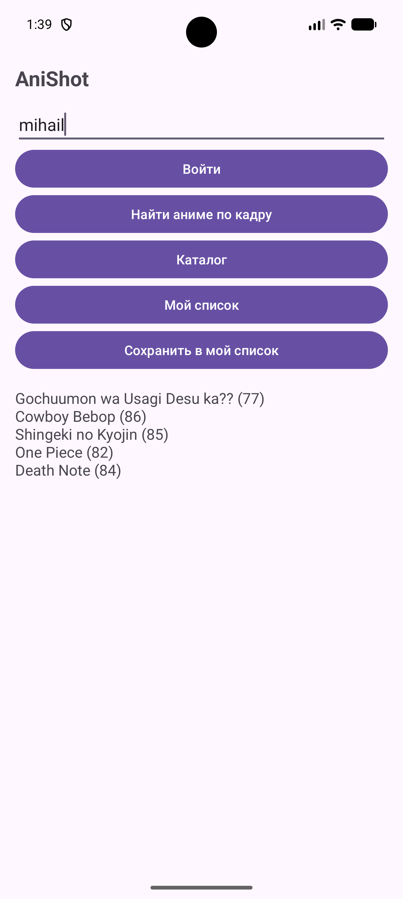
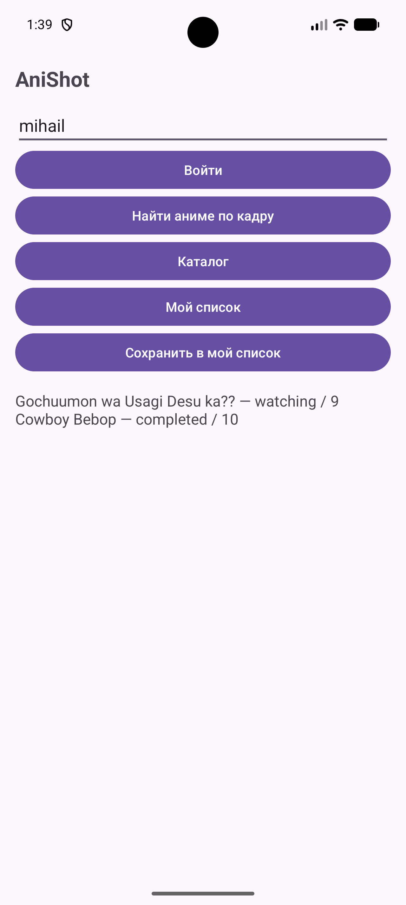

# Практическая работа № 1

Дисциплина «Разработка мобильных приложений». Проектирование приложения и каркас Android-проекта.

**Студент:** Данилов Михаил Алексеевич  
**Группа:** БСБО-09-23  
**Проект:** AniShot, пакет `ru.mirea.danilov.anishot`

---

## Содержание

1. [Цель работы](#1-цель-работы)
2. [Задание](#2-задание)
3. [Проектирование приложения](#3-проектирование-приложения)
    - [Описание приложения](#31-описание-приложения)
    - [Диаграмма вариантов использования](#32-диаграмма-вариантов-использования)
    - [Функциональные возможности](#33-функциональные-возможности)
    - [Экраны и разделение на слои](#34-экраны-и-разделение-на-слои)
    - [Анализ модели TensorFlow Lite](#35-анализ-модели-tensorflow-lite)
4. [Реализация каркаса](#4-реализация-каркаса)
    - [Создание проекта](#41-создание-проекта)
    - [Структура слоёв](#42-структура-слоёв)
    - [Сущности и репозитории](#43-сущности-и-репозитории)
    - [Классы use-case](#44-классы-use-case)
    - [Связь presentation и domain](#45-связь-presentation-и-domain)
    - [Работа каркаса](#46-работа-каркаса)
5. [Вывод](#5-вывод)

---

## 1. Цель работы

Спроектировать собственное Android-приложение: построить диаграмму вариантов использования, определить экраны и зоны ответственности слоёв presentation, domain и data, выполнить анализ готовой модели TensorFlow Lite. На основе проекта Empty Views Activity реализовать каркас: классы use-case слоя domain и реализации репозиториев слоя data, возвращающие тестовые данные.

## 2. Задание

1. Сформировать диаграмму вариантов использования приложения (draw.io).  
2. Обеспечить на диаграмме функциональные возможности, указанные в методических указаниях (авторизация; внешний JSON-сервис; сохранение в БД; список сущностей с изображениями; страница сущности; различие гостя и авторизованного пользователя; обученная модель TFLite).  
3. На основе use-case спроектировать экраны с указанием зоны ответственности.  
4. Создать проект `ru.mirea.<фамилия>.<название>` (Empty Views Activity).  
5. Создать классы use-case, указанные на этапе проектирования, в слоях domain и data. Репозиторий должен возвращать тестовые данные.

## 3. Проектирование приложения

### 3.1. Описание приложения

Разрабатываемое приложение **AniShot** предназначено для поиска аниме по кадру. Пользователь передаёт изображение (фотография или кадр, выбранный из видео). На устройстве строится семантическая маска кадра. Кадр отправляется во внешний сервис **trace.moe**, который возвращает JSON с названием тайтла, номером серии, таймкодом, превью-кадром и превью-клипом сцены. Карточка тайтла дополняется данными каталога **AniList** (постер, средняя оценка, описание). Авторизованный пользователь может оценить тайтл, сохранить его в «мой список» и сохранить найденную сцену.

Сущности предметной области: `User`, `Anime`, `SceneMatch`, `ListEntry`, `Frame`, `FrameMask`.

### 3.2. Диаграмма вариантов использования

Диаграмма построена в draw.io. Система — прямоугольник **AniShot**. Сценарии сгруппированы по контекстам: **Аккаунт**, **Поиск**, **Мой список**.

**Актёры**

| Актёр | Назначение |
|---|---|
| Гость | вход, регистрация, поиск по кадру, просмотр каталога и карточки, просмотр профиля |
| Авторизованный пользователь | обобщение гостя; оценка, сохранение в список, сохранение сцены, выход |
| trace.moe | внешняя система, JSON API сцены |
| AniList | внешняя система, JSON каталога и оценки |

Обобщение актёров: авторизованный пользователь является специализацией гостя (отношение с пустым треугольником).

**Связи между сценариями**

- ассоциация — сплошная линия без стрелки, только между актёром и сценарием;  
- включение «include» — пунктирная стрелка от базового сценария к обязательному: «Найти аниме по кадру» включает «Построить маску кадра» и «Показать превью кадра и клипа»;  
- расширение «extend» — пунктирная стрелка от необязательного сценария к базовому: «Выбрать кадр из видео» расширяет поиск; «Оценить аниме» и «Сохранить в мой список» расширяют карточку; «Сохранить найденную сцену» расширяет превью; «Выйти» расширяет профиль.

Диаграмма приведена на рисунке 1.




### 3.3. Функциональные возможности

В приложении заложены возможности, требуемые методическими указаниями. Их реализация в последующих практических работах выполняется по сценариям диаграммы.

| № | Требование | Реализация в AniShot |
|---|---|---|
| 1 | Авторизация | сценарии «Войти», «Зарегистрироваться», «Выйти», «Просмотреть профиль» |
| 2 | Внешний сервис в формате JSON | `https://api.trace.moe` — сцена, кадр, клип; `https://graphql.anilist.co` — каталог, постер, оценка. Оба сервиса отдают JSON по HTTPS |
| 3 | Сохранение данных в БД | «Мой список», оценка, сохранённые сцены. На данной работе — тестовые данные репозитория; локальная БД подключается далее |
| 4 | Список сущностей с изображениями | каталог (постеры), результаты поиска (превью-кадры), «мой список» |
| 5 | Страница сущности | карточка аниме: постер, оценка, описание, блок найденной сцены |
| 6 | Различие гостя и пользователя | гость выполняет поиск и просмотр; оценка и сохранение доступны только авторизованному пользователю |
| 7 | Обученная модель TFLite | сценарий «Построить маску кадра»; модель — DeepLab v3 (см. п. 3.5) |

### 3.4. Экраны и разделение на слои

На основе use-case спроектированы экраны. Экран обращается только к слою domain. Соответствие экранов и сценариев — на рисунке 2 (постановка аналогична декомпозиции на слои в методических указаниях: presentation — экраны, domain — use-case и сущности).




| Экран (presentation) | Use-case (domain) |
|---|---|
| Вход / Профиль | Войти, Зарегистрироваться, Просмотреть профиль, Выйти |
| Поиск по кадру | Найти аниме по кадру, Выбрать кадр из видео, Построить маску кадра, Показать превью кадра и клипа |
| Каталог | Просмотреть каталог аниме |
| Карточка аниме | Открыть карточку аниме, Оценить аниме, Сохранить в мой список, Сохранить найденную сцену |
| Мой список | Просмотреть мой список |

**Слои**

- **presentation** — Activity, разметка; реакция на события UI, вызов use-case.  
- **domain** — сущности, интерфейсы репозиториев, классы use-case. Слой не зависит от Android, сети и БД.  
- **data** — реализации репозиториев. На данном этапе возвращают тестовые данные; Context используется только в data.

Поток данных: событие UI → use-case → репозиторий → сущность → результат в UI.

### 3.5. Анализ модели TensorFlow Lite

Пункт 7 задания: анализ готовых моделей TensorFlow Lite (изображение, аудио, маски). Идентификация тайтла по кадру выполняется внешним JSON-сервисом: готовой модели «кадр принадлежит серии N» нет.

Для сценария «Построить маску кадра» выбрана официальная модель **DeepLab v3** (семантическая сегментация, пример TensorFlow Lite Image Segmentation):

- вход — RGB-кадр;
- выход — маска классов PASCAL VOC, в том числе `person`;
- в приложении — показать маску на экране поиска до отправки кадра во внешний сервис;
- файл `.tflite` размещается в `assets`, обучение модели не выполняется.

На практике 1 инференс не подключается: `BuildFrameMaskUseCase` получает тестовый результат из `FrameMaskRepositoryImpl`.

## 4. Реализация каркаса

### 4.1. Создание проекта

Создан проект Empty Views Activity.

- имя приложения: AniShot;  
- пакет: `ru.mirea.danilov.anishot`.

Проект на этом этапе — каркас: use-case и репозитории с тестовыми данными.

### 4.2. Структура слоёв

```
ru.mirea.danilov.anishot
├── MainActivity.java
├── domain
│   ├── LoginUseCase.java
│   ├── RegisterUseCase.java
│   ├── GetProfileUseCase.java
│   ├── LogoutUseCase.java
│   ├── IdentifyAnimeByFrameUseCase.java
│   ├── SelectFrameFromVideoUseCase.java
│   ├── BuildFrameMaskUseCase.java
│   ├── GetScenePreviewUseCase.java
│   ├── GetAnimeCatalogUseCase.java
│   ├── GetAnimeDetailsUseCase.java
│   ├── RateAnimeUseCase.java
│   ├── SaveToMyListUseCase.java
│   ├── SaveFoundSceneUseCase.java
│   ├── GetMyListUseCase.java
│   ├── models
│   │   ├── User.java
│   │   ├── Anime.java
│   │   ├── SceneMatch.java
│   │   ├── ListEntry.java
│   │   ├── Frame.java
│   │   └── FrameMask.java
│   └── repository
│       ├── AuthRepository.java
│       ├── AnimeRepository.java
│       ├── SceneRepository.java
│       ├── ListRepository.java
│       └── FrameMaskRepository.java
└── data
    └── repository
        ├── AuthRepositoryImpl.java
        ├── AnimeRepositoryImpl.java
        ├── SceneRepositoryImpl.java
        ├── ListRepositoryImpl.java
        └── FrameMaskRepositoryImpl.java
```

Интерфейс репозитория расположен в domain, реализация — в data (`*Impl`). Use-case принимает интерфейс через конструктор. Слой domain не зависит от data.

### 4.3. Сущности и репозитории

Сущности — набор полей без бизнес-логики. Интерфейс репозитория в domain, реализация в data. Реализация возвращает тестовые данные.

**Листинг 1** — сущность `User`

```java
package ru.mirea.danilov.anishot.domain.models;

public class User {
    private int id;
    private String login;
    private boolean guest;

    public User(int id, String login, boolean guest) {
        this.id = id;
        this.login = login;
        this.guest = guest;
    }

    public int getId() {
        return id;
    }

    public String getLogin() {
        return login;
    }

    public boolean isGuest() {
        return guest;
    }
}
```

**Листинг 2** — интерфейс `AuthRepository` (слой domain)

```java
package ru.mirea.danilov.anishot.domain.repository;

import ru.mirea.danilov.anishot.domain.models.User;

public interface AuthRepository {
    boolean login(String login, String password);

    boolean register(String login, String password);

    User getProfile();

    void logout();
}
```

**Листинг 3** — `AuthRepositoryImpl` (слой data, тестовые данные)

```java
package ru.mirea.danilov.anishot.data.repository;

import android.content.Context;

import ru.mirea.danilov.anishot.domain.models.User;
import ru.mirea.danilov.anishot.domain.repository.AuthRepository;

public class AuthRepositoryImpl implements AuthRepository {
    private User currentUser;

    public AuthRepositoryImpl(Context context) {
        this.currentUser = new User(0, "guest", true);
    }

    @Override
    public boolean login(String login, String password) {
        currentUser = new User(1, login, false);
        return true;
    }

    @Override
    public boolean register(String login, String password) {
        currentUser = new User(2, login, false);
        return true;
    }

    @Override
    public User getProfile() {
        return currentUser;
    }

    @Override
    public void logout() {
        currentUser = new User(0, "guest", true);
    }
}
```

**Листинг 4** — `AnimeRepositoryImpl`: тестовый каталог с URL изображений

```java
public AnimeRepositoryImpl(Context context) {
    catalog = new ArrayList<>();
    catalog.add(new Anime(21416, "Gochuumon wa Usagi Desu ka??",
            "https://s4.anilist.co/file/anilistcdn/media/anime/cover/medium/b21416-Uz6b7CKnKz9K.jpg", 77));
    catalog.add(new Anime(1, "Cowboy Bebop",
            "https://s4.anilist.co/file/anilistcdn/media/anime/cover/medium/bx1-CXtrrkMpJ8Zq.png", 86));
    catalog.add(new Anime(16498, "Shingeki no Kyojin",
            "https://s4.anilist.co/file/anilistcdn/media/anime/cover/medium/bx16498-73IhOXpJZiMF.jpg", 85));
    catalog.add(new Anime(21, "One Piece",
            "https://s4.anilist.co/file/anilistcdn/media/anime/cover/medium/nx21-tXMN3Y20AIKV.jpg", 82));
    catalog.add(new Anime(1535, "Death Note",
            "https://s4.anilist.co/file/anilistcdn/media/anime/cover/medium/bx1535-lawCwhzhihED.jpg", 84));
}
```

Конструкторы реализаций принимают `Context`. В слой domain `Context` не передаётся.

### 4.4. Классы use-case

Каждый сценарий диаграммы — класс с методом `execute`. Use-case получает интерфейс репозитория через конструктор.

**Листинг 5** — `LoginUseCase` (сценарий «Войти»)

```java
package ru.mirea.danilov.anishot.domain;

import ru.mirea.danilov.anishot.domain.repository.AuthRepository;

public class LoginUseCase {
    private AuthRepository authRepository;

    public LoginUseCase(AuthRepository authRepository) {
        this.authRepository = authRepository;
    }

    public boolean execute(String login, String password) {
        if (login == null || login.isEmpty()) {
            return false;
        }
        if (password == null || password.isEmpty()) {
            return false;
        }
        return authRepository.login(login, password);
    }
}
```

**Листинг 6** — `SaveToMyListUseCase` (гость получает отказ)

```java
public boolean execute(ListEntry entry) {
    User user = authRepository.getProfile();
    if (user.isGuest()) {
        return false;
    }
    if (entry.getTitle().isEmpty()) {
        return false;
    }
    return listRepository.saveToList(entry);
}
```

Остальные сценарии диаграммы реализованы так же: регистрация, профиль, выход, поиск по кадру, кадр из видео, маска, превью, каталог, карточка, оценка, сохранение сцены, мой список.

### 4.5. Связь presentation и domain

`MainActivity` создаёт реализации репозиториев и передаёт их в use-case. Смена реализации репозитория не требует правок domain.

**Листинг 7** — фрагмент `MainActivity.onCreate`

```java
AuthRepository authRepository = new AuthRepositoryImpl(this);
AnimeRepository animeRepository = new AnimeRepositoryImpl(this);
SceneRepository sceneRepository = new SceneRepositoryImpl(this);
ListRepository listRepository = new ListRepositoryImpl(this);
FrameMaskRepository frameMaskRepository = new FrameMaskRepositoryImpl(this);

findViewById(R.id.buttonLogin).setOnClickListener(new View.OnClickListener() {
    @Override
    public void onClick(View view) {
        Boolean result = new LoginUseCase(authRepository)
                .execute(editTextLogin.getText().toString(), "test");
        User user = new GetProfileUseCase(authRepository).execute();
        textViewResult.setText(String.format("Login result %s, user %s",
                result, user.getLogin()));
    }
});
```

Для гостя сохранение в список возвращает `false`, «мой список» пуст. После входа те же операции выполняются.

### 4.6. Работа каркаса

Каркас запущен на устройстве. Репозитории отдают тестовые данные, без сети и БД.










## 5. Вывод

В ходе практической работы № 1 спроектировано приложение AniShot и реализован его программный каркас.

1. Построена диаграмма вариантов использования: актёры (гость, авторизованный пользователь, внешние системы), пакеты сценариев, отношения ассоциации, включения, расширения и обобщения.  
2. На диаграмме отражены семь обязательных возможностей: авторизация, внешний JSON, сохранение данных, список с изображениями, страница сущности, различие гостя и пользователя, использование модели TFLite.  
3. Спроектированы экраны и распределение ответственности по слоям presentation, domain и data.  
4. Выполнен анализ готовой модели TensorFlow Lite: для маски кадра выбрана DeepLab v3.  
5. Создан проект `ru.mirea.danilov.anishot`. В слое domain реализованы сущности, интерфейсы репозиториев и классы use-case, соответствующие диаграмме. В слое data реализации репозиториев возвращают тестовые данные. Слой domain не зависит от data. Каркас проверен на устройстве: вход, поиск по кадру, каталог, список и сохранение (рисунки 3–7).

Сеть, локальная БД и инференс TFLite в рамках практики 1 не подключались: репозиторий возвращает тестовые данные.
