# Практическая работа № 2

Дисциплина «Разработка мобильных приложений». Модульный проект, прототип, Firebase Auth, три способа хранения данных.

**Студент:** Данилов Михаил Алексеевич  
**Группа:** БСБО-09-23  
**Проект:** AniShot, пакет `ru.mirea.danilov.anishot`

---

## Содержание

1. [Цель работы](#1-цель-работы)
2. [Задание](#2-задание)
3. [Прототип](#3-прототип)
4. [Модули data и domain](#4-модули-data-и-domain)
5. [Авторизация Firebase](#5-авторизация-firebase)
6. [Три способа обработки данных](#6-три-способа-обработки-данных)
    - [SharedPreferences](#61-sharedpreferences--информация-о-клиенте)
    - [NetworkApi](#62-networkapi--мок-json)
    - [Room](#63-room--мой-список)
7. [Работа приложения](#7-работа-приложения)
8. [Вывод](#8-вывод)

---

## 1. Цель работы

Разбить проект практики 1 на модули `app`, `domain` и `data`, выполнить прототип экранов, вынести авторизацию в отдельную Activity на Firebase Auth и реализовать в репозитории три канала данных: SharedPreferences, Room и NetworkApi с замоканным JSON.

## 2. Задание

1. Нарисовать прототип приложения в Figma или аналоге.  
2. Создать модули `data` и `domain`, перенести соответствующий код.  
3. Создать Activity авторизации на Firebase Auth; логику Firebase распределить между тремя модулями.  
4. В репозитории реализовать три способа обработки данных: SharedPreferences (информация о клиенте); Room; класс NetworkApi с замоканными данными.

Перед этими пунктами методичка повторяет функциональные требования приложения. Где закрыт каждый пункт — в таблицах.

| Пункт задания | Где закрыто |
|---|---|
| Прототип в Figma или аналоге | раздел 3, рисунки 1–10 |
| Модули `data` и `domain`, перенос кода | раздел 4 |
| Activity авторизации, логика Firebase по трём модулям | раздел 5 |
| SharedPreferences, Room, NetworkApi с моком | раздел 6 |

| № | Требование приложения | Реализация в этой работе |
|---|---|---|
| 1 | Авторизация | `AuthActivity`, Firebase Auth, регистрация и гость |
| 2 | Внешний сервис в формате JSON | `NetworkApi` отдаёт JSON каталога и сцены. Пункт 4 задания требует замоканные данные, поэтому ответ собирается в этом классе, а не HTTP-запросом. В JSON есть адреса постеров |
| 3 | Сохранение в БД | Room, база `anishot.db`, таблица `list_entries` |
| 4 | Список сущностей с изображениями | каталог и «Мой список», постеры по URL из JSON |
| 5 | Страница сущности | `DetailsActivity`: постер, оценка, описание |
| 6 | Разные возможности гостя и пользователя | гость открывает каталог и карточку; `SaveToMyListUseCase` для гостя возвращает false, на карточке показывается пояснение |
| 7 | Обученная модель TFLite | анализ DeepLab v3 выполнен в практической работе № 1. Экран поиска вызывает `BuildFrameMaskUseCase` и показывает метку маски. Файл `.tflite` и интерпретатор в этой работе не подключались: четыре пункта задания практики 2 этого не требуют |

## 3. Прототип

Задание: нарисовать прототип в Figma или аналогичном сервисе. Макет сделан интерактивной вёрсткой. Файл: [`design/kadr-android-prototype.html`](design/kadr-android-prototype.html).

Светлая тема: бумажный фон, коралловый акцент, заголовки антиквой, тёмная нижняя плашка. На плашке четыре иконки без подписей: поиск, каталог, список, профиль. Активная иконка коралловая. Объёмные иллюстрации: камера, плёнка под лупой, стопка карточек, хлопушка с замком. В приложении картинка медленно наезжает, подписи над ней покачиваются.

Кнопка «Дальше» листает три шага онбординга до формы входа. «Найти» показывает совпадение. «В список» на карточке гостя открывает пояснение. В рамке макета каталога четыре карточки. В JSON приложения тайтлов пять, пятый — «Атака титанов».


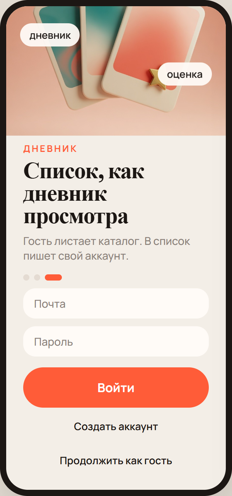

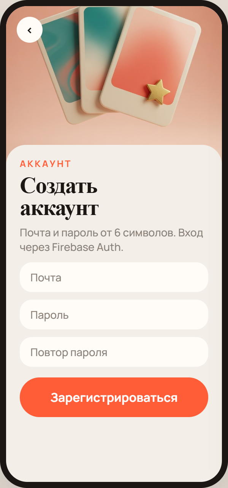

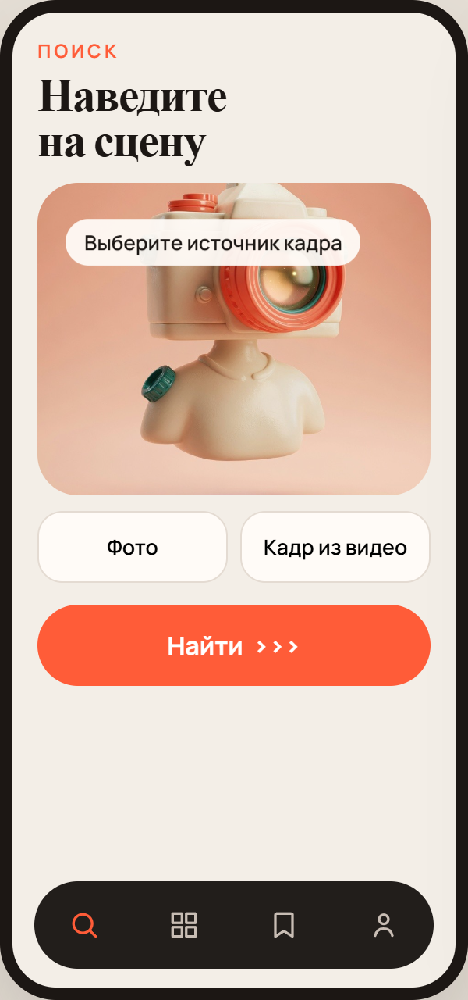

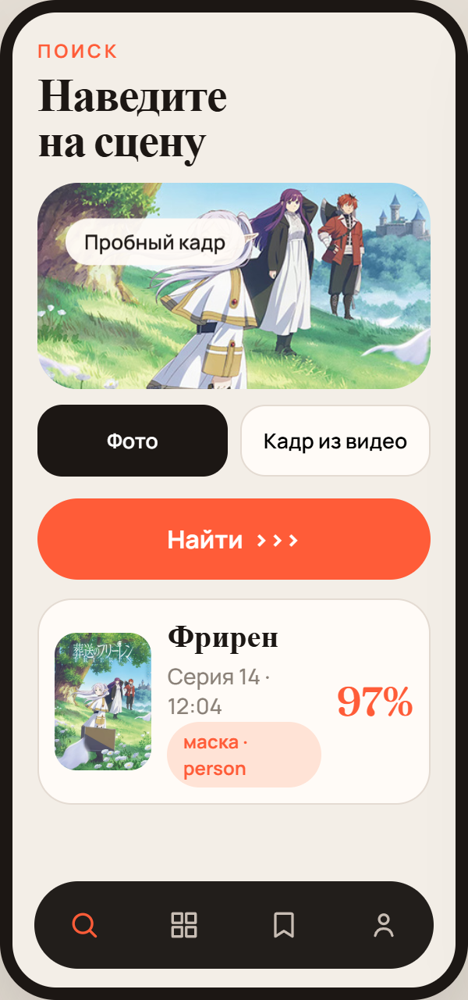

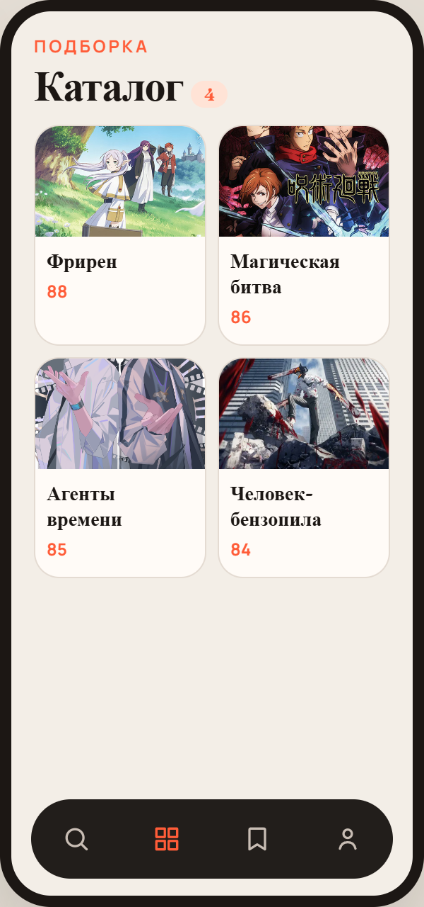

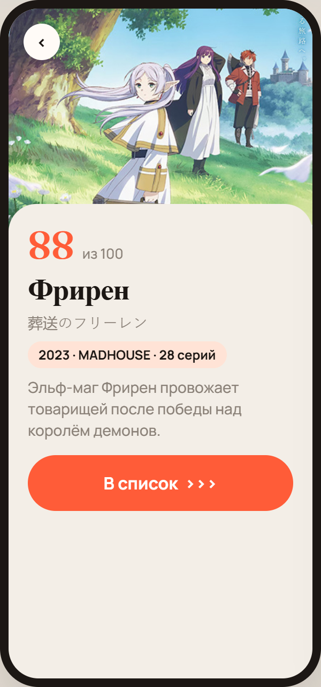

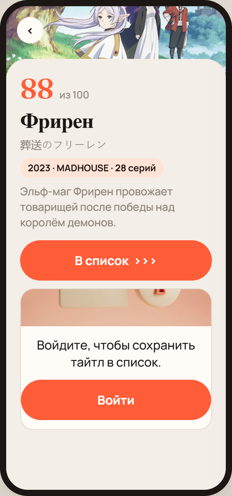

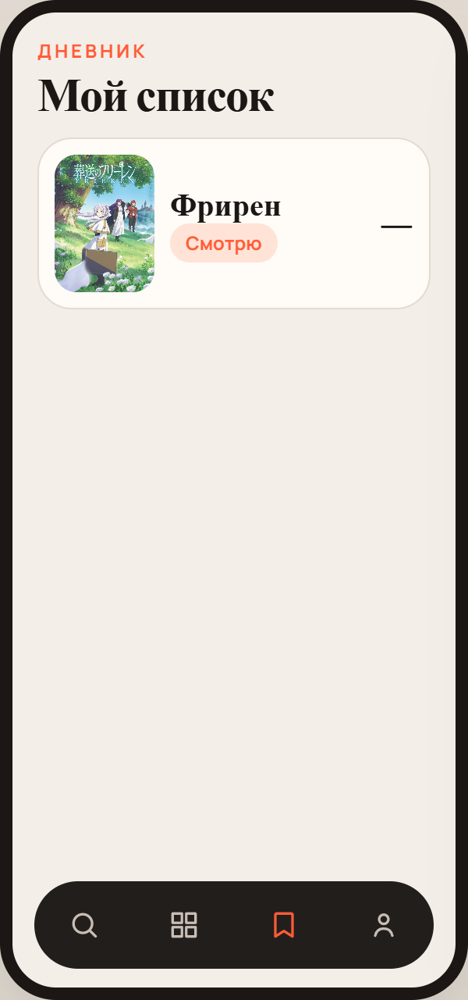

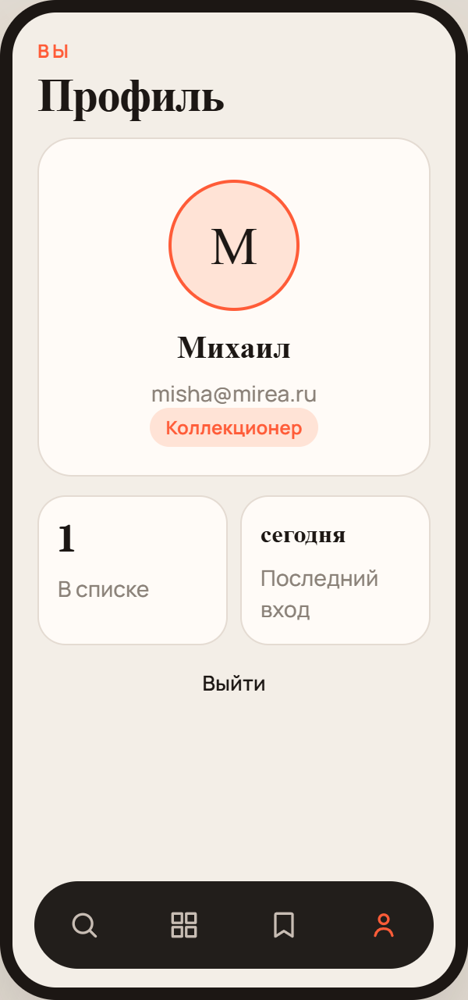

## 4. Модули data и domain

Код практики 1 разнесён по Gradle-модулям. Слой `domain` — Java-библиотека без Android. Слой `data` — Android-библиотека. Слой `app` — presentation.

Зависимости: `app` → `data` → `domain`.

```
Anishot/
├── app/                          presentation
│   ├── AnishotApp.java
│   └── presentation
│       ├── AuthActivity.java
│       ├── RegisterActivity.java
│       ├── HomeActivity.java
│       ├── search/SearchFragment.java
│       ├── catalog/CatalogFragment.java
│       ├── details/DetailsActivity.java
│       ├── list/MyListFragment.java
│       └── profile/ProfileFragment.java
├── domain/                       без Android
│   └── src/main/java/.../domain
│       ├── LoginUseCase.java
│       ├── RegisterUseCase.java
│       ├── GetMyListUseCase.java
│       ├── models/
│       └── repository/
│           ├── AuthRepository.java
│           ├── AuthCallback.java
│           ├── AnimeRepository.java
│           └── ListRepository.java
└── data/                         реализации
    └── src/main/java/.../data
        ├── firebase/FirebaseAuthDataSource.java
        ├── network/NetworkApi.java
        ├── repository/*Impl.java
        └── storage
            ├── client/sharedprefs/SharedPrefClientStorage.java
            └── room/AppDatabase.java, ListDao.java, ListEntryEntity.java
```

**Листинг 1** — подключение модулей, `settings.gradle.kts`

```kotlin
rootProject.name = "Anishot"
include(":app")
include(":domain")
include(":data")
```

**Листинг 2** — зависимости `app/build.gradle.kts`

```kotlin
dependencies {
    implementation(project(":domain"))
    implementation(project(":data"))
    implementation(platform(libs.firebase.bom))
    implementation(libs.firebase.auth)
}
```

Модуль `domain` подключает только `java-library`. Модуль `data` — `com.android.library`, Room и Firebase Auth.

## 5. Авторизация Firebase

Логика Firebase распределена по трём модулям.

| Модуль | Класс | Роль |
|---|---|---|
| domain | `AuthRepository`, `AuthCallback`, `LoginUseCase`, `RegisterUseCase` | контракт и проверка полей |
| data | `FirebaseAuthDataSource`, `AuthRepositoryImpl` | `signInWithEmailAndPassword`, `createUserWithEmailAndPassword` |
| app | `AuthActivity`, `RegisterActivity` | UI, вызов use-case |

`AuthActivity` — LAUNCHER. Кнопки: Войти, Создать аккаунт, Продолжить как гость.

**Листинг 3** — `AuthRepository` (domain)

```java
public interface AuthRepository {
    void login(String email, String password, AuthCallback callback);

    void register(String email, String password, AuthCallback callback);

    User getProfile();

    void logout();

    void continueAsGuest();
}
```

**Листинг 4** — `LoginUseCase` (domain)

```java
public void execute(String email, String password, AuthCallback callback) {
    if (email == null || email.isEmpty() || !email.contains("@")) {
        callback.onError("Укажите почту");
        return;
    }
    if (password == null || password.length() < 6) {
        callback.onError("Пароль от 6 символов");
        return;
    }
    authRepository.login(email, password, callback);
}
```

**Листинг 5** — `FirebaseAuthDataSource` (data)

```java
public void signIn(String email, String password, AuthCallback callback) {
    firebaseAuth.signInWithEmailAndPassword(email, password)
            .addOnCompleteListener(task -> {
                if (task.isSuccessful()) {
                    callback.onSuccess();
                } else {
                    callback.onError(messageOf(task.getException()));
                }
            });
}
```

**Листинг 6** — фрагмент `AuthActivity` (app)

```java
findViewById(R.id.buttonLogin).setOnClickListener(view -> {
    loginUseCase.execute(
            String.valueOf(email.getText()),
            String.valueOf(password.getText()),
            new AuthCallback() {
                @Override
                public void onSuccess() {
                    openHome();
                }

                @Override
                public void onError(String message) {
                    error.setVisibility(View.VISIBLE);
                    error.setText(message);
                }
            }
    );
});
findViewById(R.id.buttonGuest).setOnClickListener(view -> {
    app.authRepository().continueAsGuest();
    openHome();
});
```

После успешного ответа Firebase email и дата входа записываются в SharedPreferences. Гость сохраняется там же с флагом `guest = true`.

В `app/google-services.json` лежит заготовка пакета `ru.mirea.danilov.anishot`. Для входа по почте файл заменяется на ключ из Firebase Console (Authentication → Email/Password). Режим гостя работает без замены файла.

## 6. Три способа обработки данных

Модели слоёв разделены. Domain: `User`, `Anime`, `ListEntry`. Data: `ClientRecord`, `ListEntryEntity`, JSON `NetworkApi`. Класс хранения не видит модель domain. `ClientRecord` хранит id, почту, признак гостя и дату. Репозиторий переводит запись в `User` (листинг 14). Список устроен так же: `ListEntry` в domain, `ListEntryEntity` в Room. JSON каталога становится `Anime` только в `AnimeRepositoryImpl`.

### 6.1. SharedPreferences — информация о клиенте

`ClientStorage` / `SharedPrefClientStorage` / `ClientRecord`: email, признак гостя, дата последнего входа. Это не сущность domain.

**Листинг 7** — `SharedPrefClientStorage`

```java
public boolean save(ClientRecord record) {
    sharedPreferences.edit()
            .putString(KEY_EMAIL, record.getEmail())
            .putBoolean(KEY_GUEST, record.isGuest())
            .putString(KEY_DATE, record.getLocalDate())
            .putInt(KEY_ID, record.getId())
            .commit();
    return true;
}
```

### 6.2. NetworkApi — мок JSON

`NetworkApi.getCatalogJson()` и `getSceneJson()` возвращают строку JSON. `AnimeRepositoryImpl` разбирает её в сущности domain. Позже тело заменяется на HTTP.

**Листинг 8** — `NetworkApi.getCatalogJson` (фрагмент)

```java
public String getCatalogJson() {
    return "["
            + "{\"id\":1,\"title\":\"Фрирен\",\"score\":88,...},"
            + "{\"id\":2,\"title\":\"Магическая битва\",\"score\":86,...}"
            + "]";
}
```

**Листинг 9** — разбор JSON в `AnimeRepositoryImpl`

```java
JSONArray array = new JSONArray(networkApi.getCatalogJson());
for (int i = 0; i < array.length(); i++) {
    catalog.add(mapToDomain(array.getJSONObject(i)));
}
```

### 6.3. Room — мой список

`ListEntryEntity`, `ListDao`, `AppDatabase` (`anishot.db`). `ListRepositoryImpl` принимает `Context` и скрывает Room от модуля `app`.

**Листинг 10** — `ListEntryEntity`

```java
@Entity(tableName = "list_entries")
public class ListEntryEntity {
    @PrimaryKey
    public int animeId;
    @NonNull
    public String title = "";
    @NonNull
    public String status = "watching";
    public int score;
}
```

**Листинг 11** — `ListDao`

```java
@Dao
public interface ListDao {
    @Query("SELECT * FROM list_entries")
    List<ListEntryEntity> getAll();

    @Insert(onConflict = OnConflictStrategy.REPLACE)
    void upsert(ListEntryEntity entity);
}
```

**Листинг 12** — `GetMyListUseCase`: гость получает пустой список

```java
public List<ListEntry> execute() {
    User user = authRepository.getProfile();
    if (user.isGuest()) {
        return new ArrayList<>();
    }
    return listRepository.getMyList();
}
```

Связка presentation и data: `AnishotApp` создаёт реализации и отдаёт интерфейсы domain.

**Листинг 13** — фрагмент `AnishotApp.onCreate`

```java
authRepository = new AuthRepositoryImpl(
        new FirebaseAuthDataSource(),
        new SharedPrefClientStorage(this)
);
NetworkApi networkApi = new NetworkApi();
animeRepository = new AnimeRepositoryImpl(networkApi);
listRepository = new ListRepositoryImpl(this);
```

**Листинг 14** — `AuthRepositoryImpl.mapToDomain`

```java
private User mapToDomain(ClientRecord record) {
    return new User(record.getId(), record.getEmail(), record.isGuest(), record.getLocalDate());
}
```

## 7. Работа приложения

Экраны собраны по прототипу: светлый фон, онбординг перед входом, нижняя плашка из четырёх иконок без подписей.

Рисунки 11–15 — снимки работающего приложения на устройстве. Файлы: `images/fig8-auth.png`, `images/fig9-catalog.png`, `images/fig10-details.png`, `images/fig11-guest-lock.png`, `images/fig12-mylist.png`.

| Экран | Класс |
|---|---|
| Вход | `AuthActivity` |
| Регистрация | `RegisterActivity` |
| Поиск | `SearchFragment` |
| Каталог | `CatalogFragment` |
| Карточка | `DetailsActivity` |
| Мой список | `MyListFragment` |
| Профиль | `ProfileFragment` |

Гость открывает каталог и карточку. Сохранение в список доступно после входа. Каталог строится из JSON NetworkApi и показывает цветные постеры.

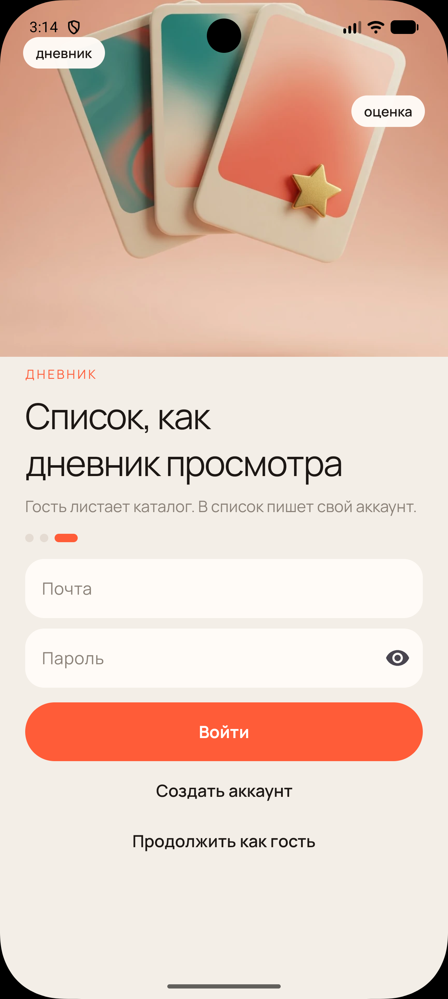

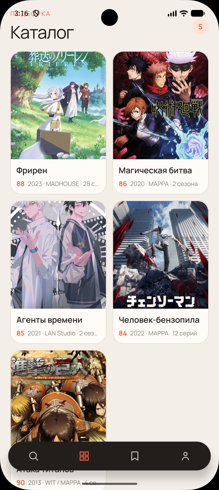

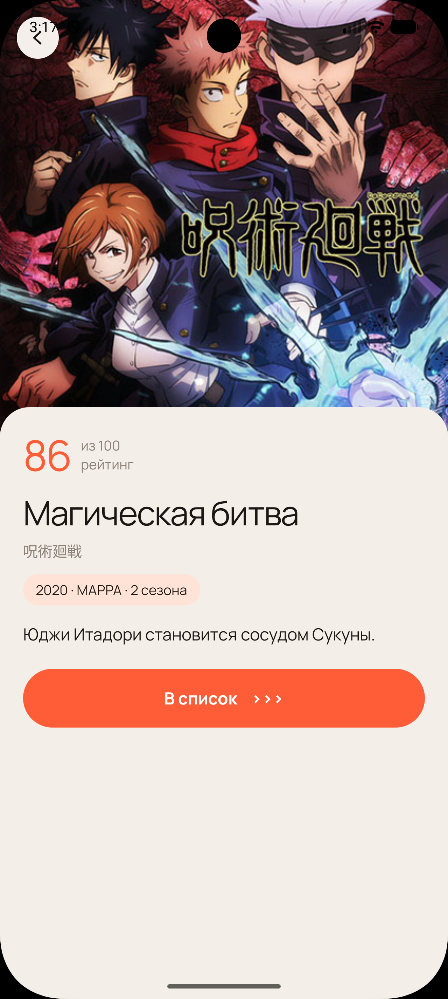

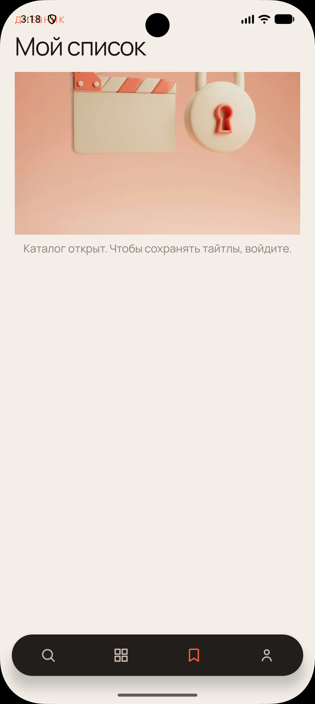

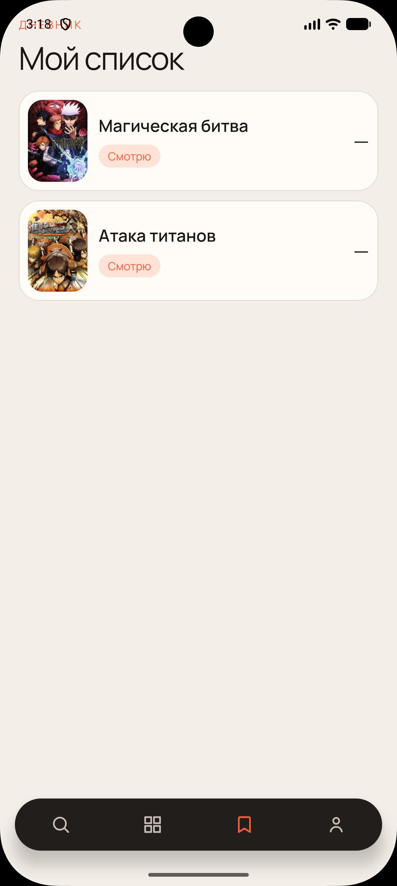

## 8. Вывод

1. Прототип экранов выполнен интерактивной вёрсткой, аналогом Figma. Кадры макета приведены на рисунках 1–10.  
2. Проект разбит на модули `app`, `domain` и `data`; код практики 1 перенесён. Слой domain не зависит от Android, Room и Firebase.  
3. Авторизация вынесена в `AuthActivity`. Firebase Auth распределён по трём модулям: контракт в domain, `FirebaseAuthDataSource` в data, UI в app.  
4. В репозитории три канала данных: SharedPreferences (клиент), Room (`anishot.db`, мой список), NetworkApi (мок JSON каталога и сцены). Гость и авторизованный пользователь различаются.
