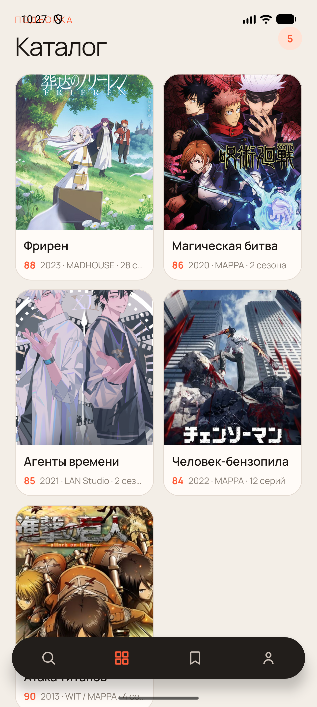
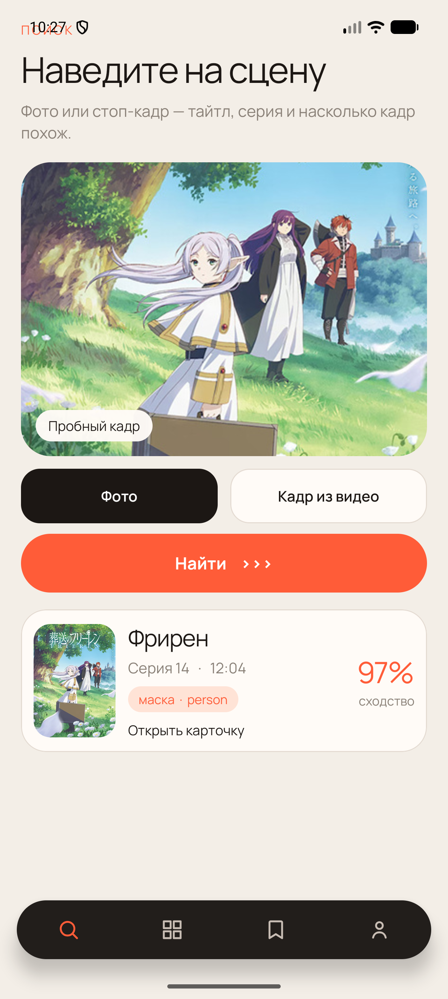
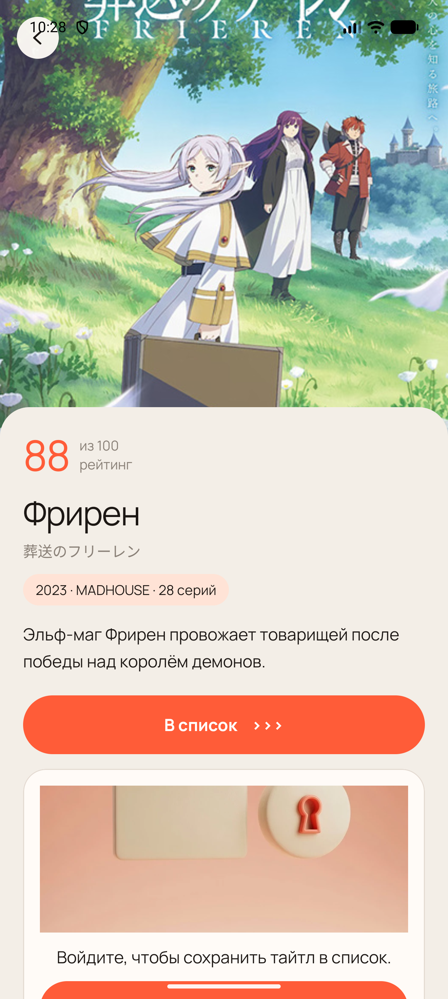
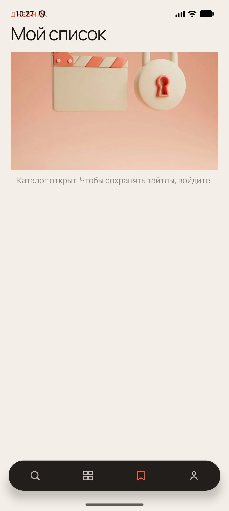
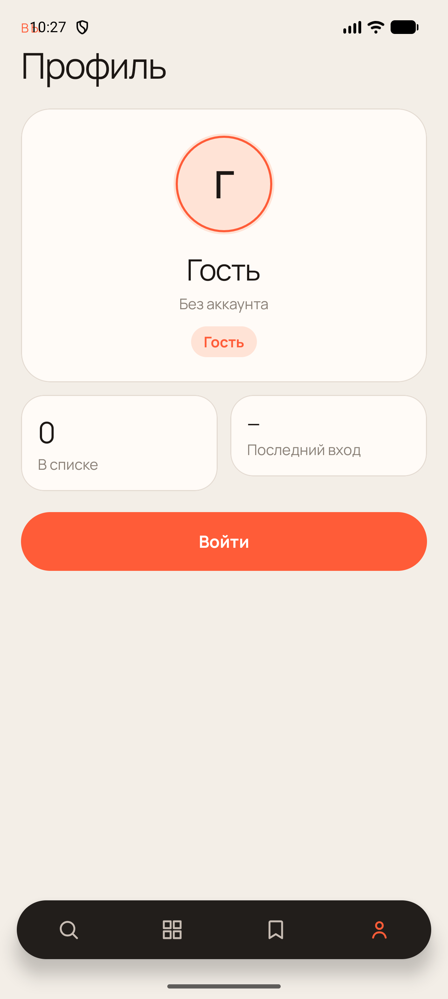

# Практическая работа № 3

Дисциплина «Разработка мобильных приложений». ViewModel, LiveData и MediatorLiveData.

**Студент:** Данилов Михаил Алексеевич  
**Группа:** БСБО-09-23  
**Проект:** AniShot, пакет `ru.mirea.danilov.anishot`

---

## Содержание

1. [Цель работы](#1-цель-работы)
2. [Задание](#2-задание)
3. [Связь экрана и domain](#3-связь-экрана-и-domain)
4. [Состояние экрана](#4-состояние-экрана)
5. [Каталог и список](#5-каталог-и-список)
6. [Вывод](#6-вывод)

---

## 1. Цель работы

Убрать из Activity и фрагментов прямые вызовы use case. Экран слушает ViewModel, состояние интерфейса приходит через LiveData. Список собирается из замоканного каталога и таблицы Room.

## 2. Задание

1. Взаимодействие Activity со слоем domain идёт через ViewModel.
2. Обновление интерфейса идёт через LiveData.
3. MediatorLiveData собирает замоканные сетевые данные и данные базы.

| Пункт | Где сделано |
| --- | --- |
| Экран не вызывает use case сам | `AnishotFactory`, модели в `presentation/vm` |
| Интерфейс слушает LiveData | каталог, поиск, карточка, профиль, вход |
| Сеть и база вместе | `ShelfViewModel` |

Слой domain остаётся Java-библиотекой без Android. LiveData в интерфейсы репозиториев не добавлялся. Сигнал Room живёт в `data` и доходит до модели как `LiveData<Long>`.

## 3. Связь экрана и domain

Модель создаётся через `ViewModelProvider`, а не конструктором `new` из Activity. Фабрика берёт уже собранные репозитории из `AnishotApp` и отдаёт модели готовые use case. Контекста и виджетов у модели нет.

**Листинг 1.** Фабрика собирает модель списка

```java
if (modelClass == ShelfViewModel.class) {
    return (T) new ShelfViewModel(
            new GetAnimeCatalogUseCase(app.animeRepository()),
            new GetMyListUseCase(app.listRepository(), app.authRepository()),
            app.authRepository(),
            app.listPulse()
    );
}
```

В конструкторе пишется создание, в `onCleared` — очистка. Пока фрагмент того же раздела жив, повторный `get` возвращает ту же модель. Смена раздела уничтожает фрагмент, и модель очищается. Поворот экрана фрагмент не уничтожает окончательно: модель остаётся, запрос каталога заново не стартует.

Переход после входа — одноразовое событие. Поворот экрана входа не открывает главный экран второй раз.

**Листинг 2.** Событие забирается один раз

```java
public Where take() {
    if (taken) {
        return null;
    }
    taken = true;
    return where;
}
```

Гостевой вход по-прежнему вызывает `continueAsGuest` у репозитория, но делает это модель, а не Activity.

## 4. Состояние экрана

Каталог, поиск, карточка и профиль отдают данные в `MutableLiveData`. Фрагмент подписывается на `getViewLifecycleOwner` и только раскладывает значения по виджетам. Адаптер каталога создаётся один раз, новый набор приходит в `setItems`.

Поиск кладёт в LiveData пару «совпадение и маска». Карточка результата рисуется, когда пара пришла. Карточка тайтла получает `Anime` тем же способом и сохраняет список через `SaveToMyListUseCase`. Гость по-прежнему видит просьбу войти и не пишет строку в Room.







## 5. Каталог и список

«Мой список» слушает два источника. Первый — каталог из замоканного `NetworkApi`: постеры и названия. Второй — `LiveData` из Room: любая запись в таблицу `list_entries` двигает счётчик. `MediatorLiveData` на каждое из этих событий заново читает список через `GetMyListUseCase` и склеивает строку с постером.

**Листинг 3.** Два источника сходятся в одно состояние

```java
state.addSource(catalog, items -> {
    latestCatalog = items == null ? new ArrayList<>() : items;
    publish();
});
state.addSource(roomPulse, tick -> publish());
```

У гостя use case возвращает пустой список, поэтому на экране остаётся прежняя фраза: «Каталог открыт. Чтобы сохранять тайтлы, войдите.» Профиль берёт пользователя и число записей из своих use case и кладёт их в одно состояние.





## 6. Вывод

Экраны AniShot берут данные у ViewModel. `ViewModelProvider` держит модель на время экрана, LiveData обновляет каталог, поиск, карточку и профиль. Список соединяет замоканный каталог и сигнал Room через MediatorLiveData. Гость по-прежнему листает каталог и не пишет в свой список.
