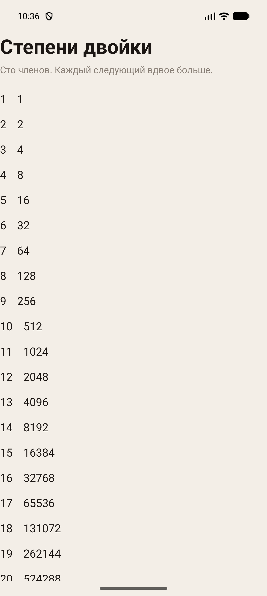
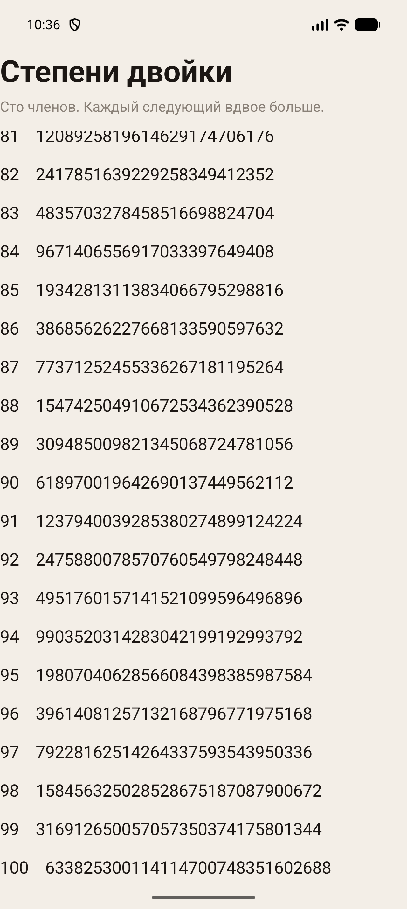
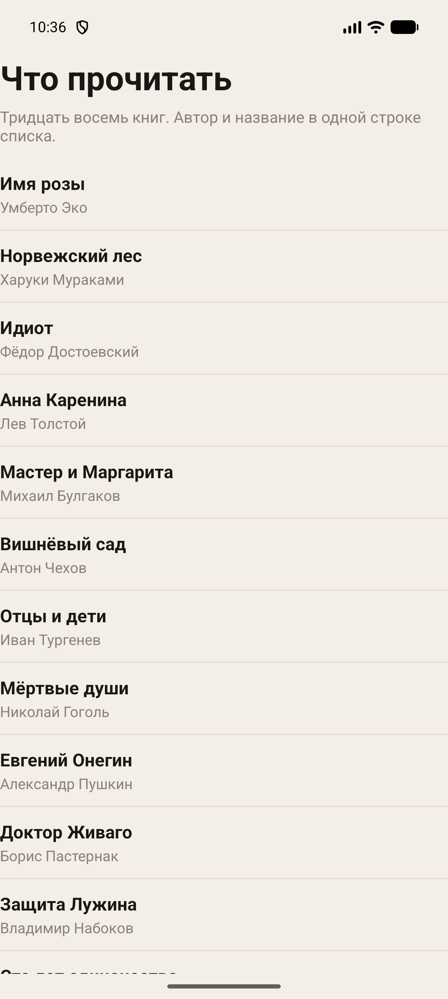
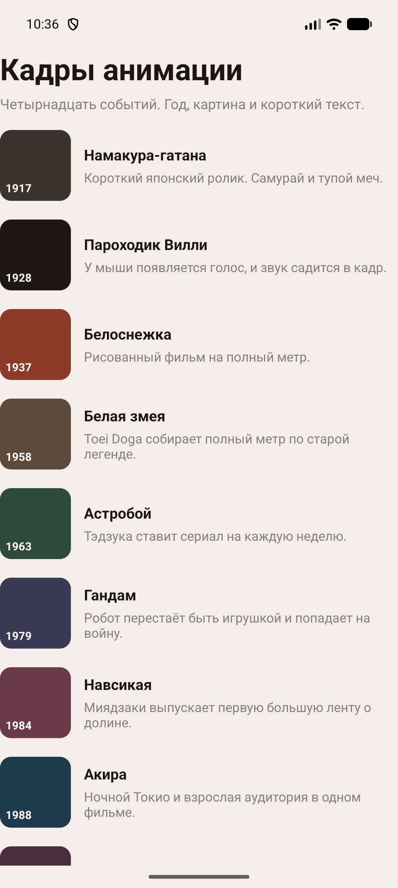
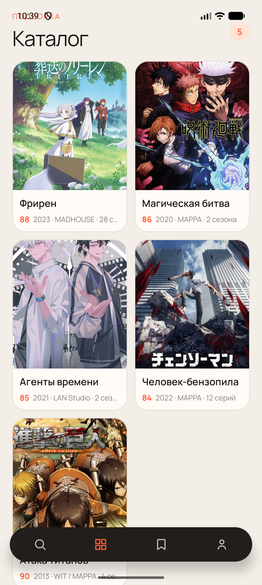

# Практическая работа № 4

Дисциплина «Разработка мобильных приложений». ScrollView, ListView и RecyclerView.

**Студент:** Данилов Михаил Алексеевич  
**Группа:** БСБО-09-23  
**Проект:** AniShot, пакет `ru.mirea.danilov.anishot`

---

## Содержание

1. [Цель работы](#1-цель-работы)
2. [Задание](#2-задание)
3. [Прогрессия](#3-прогрессия)
4. [Книги](#4-книги)
5. [События](#5-события)
6. [Каталог AniShot](#6-каталог-anishot)
7. [Вывод](#7-вывод)

---

## 1. Цель работы

Собрать три отдельных модуля со списками и провести замоканный каталог AniShot в RecyclerView через LiveData. Модули живут рядом с приложением и не трогают его экраны.

## 2. Задание

1. Модуль ScrollViewApp: геометрическая прогрессия со знаменателем 2, сто членов.
2. Модуль ListViewApp: больше тридцати книг, у каждой автор и название.
3. Список исторических событий с коротким текстом и изображением.
4. В AniShot заглушка каталога приходит в представление через LiveData и встаёт в RecyclerView.

| Пункт | Где сделано |
| --- | --- |
| Сто членов прогрессии | `ScrollViewApp`, `BigInteger` |
| Книги | `ListViewApp`, 38 строк, ViewHolder |
| События с кадром | `RecyclerViewApp` |
| Каталог из LiveData | `CatalogViewModel`, `CatalogFragment` |

В тексте задания модуль со списком событий тоже называется ListViewApp. События вынесены в отдельный модуль RecyclerViewApp. Пакеты: `ru.mirea.danilov.scrollviewapp`, `ru.mirea.danilov.listviewapp`, `ru.mirea.danilov.recyclerviewapp`.

## 3. Прогрессия

У ScrollView один прямой ребёнок — вертикальный LinearLayout. Заголовок остаётся над прокруткой. Строка берётся из `item_term.xml` через LayoutInflater. Член с номером `n` равен `2^(n-1)`: первый член 1, сотый — `2^99`. Числа не помещаются в `long`, поэтому считается `BigInteger`, а в текст уходит `toString()`.

**Листинг 1.** Сто членов со знаменателем 2

```java
LinearLayout column = findViewById(R.id.column);
LayoutInflater inflater = getLayoutInflater();
for (int index = 0; index < 100; index++) {
    BigInteger term = BigInteger.ONE.shiftLeft(index);
    View row = inflater.inflate(R.layout.item_term, column, false);
    TextView line = row.findViewById(R.id.textTerm);
    line.setText((index + 1) + "    " + term.toString());
    column.addView(row);
}
```





## 4. Книги

Список — это книги, которые хочется прочитать: проза, фантастика и книги о кино. В строке два поля, название и автор. Адаптер хранит ссылки на них во ViewHolder, чтобы при прокрутке не искать виджеты заново.

**Листинг 2.** ViewHolder для строки книги

```java
public View getView(int position, View convertView, ViewGroup parent) {
    Holder holder;
    if (convertView == null) {
        convertView = inflater.inflate(R.layout.item_book, parent, false);
        holder = new Holder(convertView);
        convertView.setTag(holder);
    } else {
        holder = (Holder) convertView.getTag();
    }
    Book book = getItem(position);
    holder.title.setText(book.title);
    holder.author.setText(book.author);
    return convertView;
}
```

В списке 38 книг. Первые строки: Эко «Имя розы», Мураками «Норвежский лес», Достоевский «Идиот», Толстой «Анна Каренина», Булгаков «Мастер и Маргарита». Дальше Чехов, Тургенев, Гоголь, Пушкин, Пастернак, Набоков, Маркес, Борхес, Кальвино, Лем, Стругацкие, Брэдбери, Ле Гуин, Дик, Гибсон, Гейман, Миядзаки, Макклауд, Ричи, Тарковский, Эйзенштейн, Норштейн, Ремарк, Хемингуэй, Сэлинджер, Оруэлл, Хаксли, Кафка, Камю, Кортасар, Зюскинд, Пелевин, Лермонтов.



## 5. События

RecyclerView показывает четырнадцать точек истории анимации. У события есть год, название, короткий текст и цветной кадр. Кадр — это `ImageView` с локальной формой, цвет задаётся у события. Адаптер создаётся один раз. Данные приходят в `setItems`, список обновляется через `notifyDataSetChanged`. LayoutManager линейный, вертикальный. Нажатие показывает год и название.

**Листинг 3.** Адаптер принимает список один раз и перерисовывает его

```java
public void setItems(List<Event> next) {
    items.clear();
    if (next != null) {
        items.addAll(next);
    }
    notifyDataSetChanged();
}
```

Первые кадры: 1917 «Намакура-гатана», 1928 «Пароходик Вилли», 1937 «Белоснежка», 1958 «Белая змея», 1963 «Астробой». Дальше «Гандам», «Навсикая», «Акира», «Призрак в доспехах», «Принцесса Мононокэ», «Унесённые призраками», «Твоё имя», «Поезд «Бесконечный»», «Мальчик и птица».



## 6. Каталог AniShot

Заглушка каталога по-прежнему лежит в `NetworkApi`. `CatalogViewModel` читает её в фоне и кладёт список в `MutableLiveData`. Фрагмент подписывается на `getViewLifecycleOwner`. Адаптер постеров создаётся один раз, новый набор уходит в `setItems`. Постеры рисует Glide. На экране пять тайтлов, счётчик в шапке совпадает с длиной списка.

**Листинг 4.** Модель отдаёт каталог как LiveData

```java
executor.execute(() -> {
    List<Anime> loaded = catalogUseCase.execute();
    catalog.postValue(loaded == null ? new ArrayList<>() : loaded);
});
```

**Листинг 5.** Фрагмент ставит список в уже созданный адаптер

```java
PosterAdapter adapter = new PosterAdapter(anime -> {
    Intent intent = new Intent(requireContext(), DetailsActivity.class);
    intent.putExtra("animeId", anime.getId());
    startActivity(intent);
});
recycler.setAdapter(adapter);
viewModel.catalog().observe(getViewLifecycleOwner(), items -> {
    List<Anime> safe = items == null ? new ArrayList<>() : items;
    count.setText(String.valueOf(safe.size()));
    adapter.setItems(safe);
});
```



## 7. Вывод

ScrollViewApp показывает сто членов прогрессии со знаменателем 2, большие числа считает `BigInteger`. ListViewApp держит 38 книг, строка помнит свои поля через ViewHolder. Исторические события с кадром вынесены в RecyclerViewApp, потому что в задании это имя модуля повторяет ListViewApp. Каталог AniShot приходит из заглушки через LiveData и заполняет RecyclerView без нового адаптера на каждое обновление.
