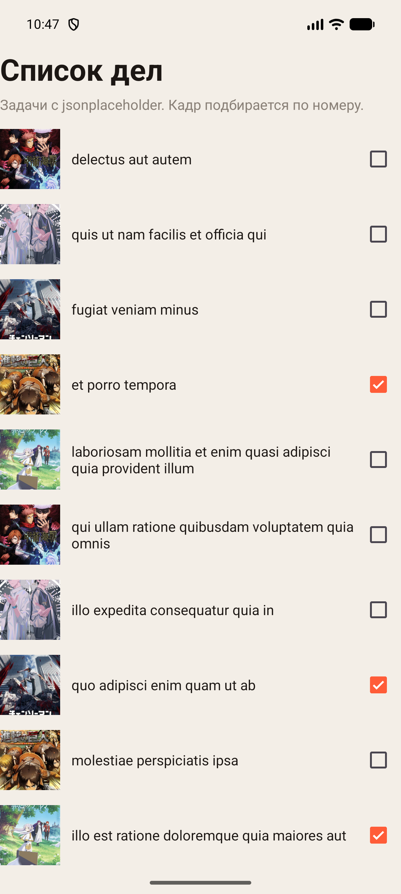
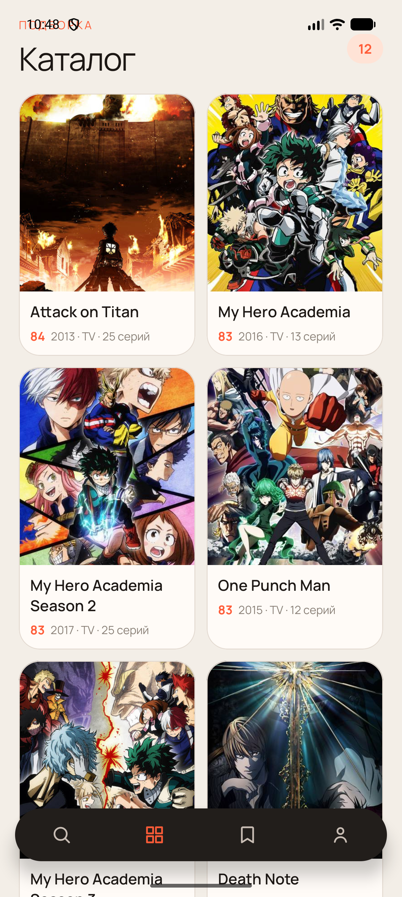
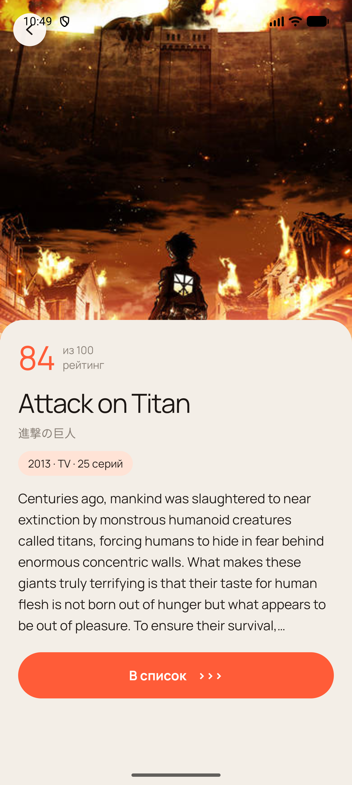
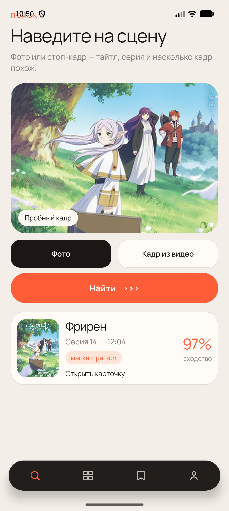

# Практическая работа № 5

Дисциплина «Разработка мобильных приложений». Retrofit и загрузка изображений.

**Студент:** Данилов Михаил Алексеевич  
**Группа:** БСБО-09-23  
**Проект:** AniShot, пакет `ru.mirea.danilov.anishot`

---

## Содержание

1. [Цель работы](#1-цель-работы)
2. [Задание](#2-задание)
3. [Список дел](#3-список-дел)
4. [Кадр у задачи](#4-кадр-у-задачи)
5. [Каталог AniShot](#5-каталог-anishot)
6. [Вывод](#6-вывод)

---

## 1. Цель работы

Получить список дел по HTTPS через Retrofit и обновлять отметку отдельным запросом. Каталог AniShot читает тайтлы из внешнего JSON, а при ошибке сети оставляет локальный набор. Постеры в приложении рисует Glide, в модуле со списком дел — Picasso.

## 2. Задание

1. Модуль RetrofitApp: список задач с jsonplaceholder и статус выполнения.
2. Смена флажка отправляет PUT `todos/{id}`. Ошибка возвращает флажок назад.
3. У задачи есть изображение. Picasso задаёт размер, обрезку, заглушку и картинку ошибки.
4. В AniShot сущности приходят из сети через Retrofit. Ошибка обрабатывается. Картинки показывает Glide.

| Пункт | Где сделано |
| --- | --- |
| GET списка дел | `RetrofitApp`, `ApiService` |
| PUT отметки | `TodoAdapter.bindCheck` |
| Picasso | `TodoAdapter`, 240×240, `centerCrop` |
| Каталог из сети | `AnimeRepositoryImpl`, Kitsu |
| Ошибка каталога | локальный JSON и строка на экране |
| Постеры AniShot | `ImageBinder`, Glide |

Пакет модуля: `ru.mirea.danilov.retrofitapp`. Запросы идут по HTTPS.

## 3. Список дел

Базовый адрес `https://jsonplaceholder.typicode.com/`. Модель `Todo` повторяет поля ответа: `userId`, `id`, `title`, `completed`. Список кладётся в RecyclerView один раз созданным адаптером. Если ответ неуспешный или запрос оборвался, на экране короткое сообщение «Список дел не загрузился».

**Листинг 1.** Клиент и загрузка списка

```java
public static final String BASE_URL = "https://jsonplaceholder.typicode.com/";

Retrofit retrofit = new Retrofit.Builder()
        .baseUrl(BASE_URL)
        .addConverterFactory(GsonConverterFactory.create())
        .build();
ApiService api = retrofit.create(ApiService.class);
api.getTodos().enqueue(new Callback<List<Todo>>() {
    @Override
    public void onResponse(Call<List<Todo>> call, Response<List<Todo>> response) {
        if (response.isSuccessful() && response.body() != null) {
            adapter.setItems(response.body());
        } else {
            Toast.makeText(MainActivity.this, R.string.load_failed, Toast.LENGTH_SHORT).show();
        }
    }

    @Override
    public void onFailure(Call<List<Todo>> call, Throwable t) {
        Toast.makeText(MainActivity.this, R.string.load_failed, Toast.LENGTH_SHORT).show();
    }
});
```

Флажок слушает только нажатие пользователя. Перед запросом запоминается прежнее значение. PUT уходит с телом задачи. Код вне 2xx и обрыв соединения возвращают флажок и показывают «Не удалось обновить задачу».

**Листинг 2.** Обновление отметки

```java
@PUT("todos/{id}")
Call<Todo> updateTodo(@Path("id") int id, @Body Todo todo);
```

```java
boolean previous = todo.isCompleted();
todo.setCompleted(checked);
api.updateTodo(todo.getId(), todo).enqueue(new Callback<Todo>() {
    @Override
    public void onResponse(Call<Todo> call, Response<Todo> response) {
        if (!response.isSuccessful()) {
            todo.setCompleted(previous);
            bindCheck(holder, todo);
            Toast.makeText(holder.itemView.getContext(), R.string.update_failed, Toast.LENGTH_SHORT).show();
        }
    }

    @Override
    public void onFailure(Call<Todo> call, Throwable t) {
        todo.setCompleted(previous);
        bindCheck(holder, todo);
        Toast.makeText(holder.itemView.getContext(), R.string.update_failed, Toast.LENGTH_SHORT).show();
    }
});
```



## 4. Кадр у задачи

У jsonplaceholder нет поля с картинкой. Адрес кадра выбирается по номеру задачи из пяти обложек. Picasso уменьшает кадр до 240×240 и обрезает по центру. Пока файл едет и если адрес пустой, на месте кадра серая плашка.

**Листинг 3.** Параметры Picasso

```java
Picasso.get()
        .load(stillFor(todo.getId()))
        .resize(240, 240)
        .centerCrop()
        .placeholder(R.drawable.frame_still)
        .error(R.drawable.frame_still)
        .into(holder.still);
```

## 5. Каталог AniShot

Каталог запрашивается один раз и хранится в репозитории. Адрес: `https://kitsu.io/api/edge/anime` с лимитом 12 и сортировкой `-userCount`. Заголовок `Accept: application/vnd.api+json`. Из ответа берутся английское название, японское написание, постер, год, тип, число серий, рейтинг и первый абзац описания.

Постеры по-прежнему грузит Glide в `ImageBinder`: обрезка по центру, плашка на время загрузки и при ошибке картинки.

Если ответ пустой, код не 2xx или запрос оборвался, на экран возвращается прежний локальный JSON. Над сеткой появляется строка «Сеть не ответила. Показан сохранённый каталог.» Повторное открытие каталога запрос не повторяет: список уже лежит в поле `remote`.

Номера 1–5 оставлены локальному каталогу, по ним открывается карточка найденного кадра. Если у тайтла из Kitsu такой же номер, к нему прибавляется 1000000, чтобы два набора не смешались. Поиск кадра по-прежнему приводит к «Фрирен»: у совпадения номер 1, и карточка читается из локального JSON.

**Листинг 4.** Сеть, а при ошибке локальный каталог

```java
Response<KitsuPage> response = kitsu.popular(12, "-userCount").execute();
if (response.isSuccessful() && response.body() != null) {
    List<Anime> loaded = response.body().toAnime();
    if (!loaded.isEmpty()) {
        fromStub = false;
        remote = loaded;
        return remote;
    }
}
fromStub = true;
remote = readStub();
return remote;
```

**Листинг 5.** Карточка ищет сначала сеть, затем локальный номер

```java
public Anime getDetails(int id) {
    Anime found = find(getCatalog(), id);
    if (found != null) {
        return found;
    }
    Anime stub = find(readStub(), id);
    if (stub != null) {
        return stub;
    }
    List<Anime> catalog = getCatalog();
    return catalog.isEmpty() ? null : catalog.get(0);
}
```







## 6. Вывод

RetrofitApp показывает задачи jsonplaceholder и отправляет PUT при смене флажка. Неуспешный ответ и обрыв возвращают флажок. Кадр задачи режет Picasso. Каталог AniShot берёт двенадцать тайтлов у Kitsu и при ошибке оставляет локальный JSON. Glide рисует постеры приложения. Карточка найденного кадра с номером 1 остаётся «Фрирен».
