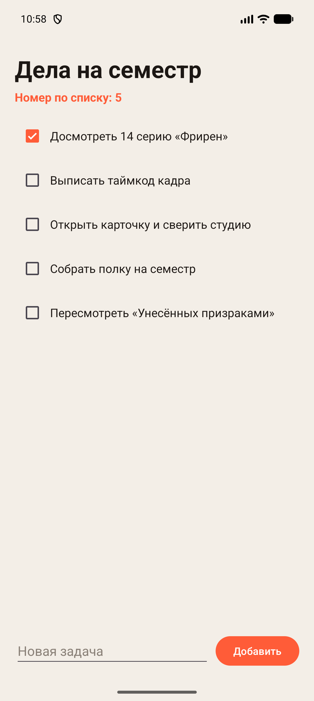
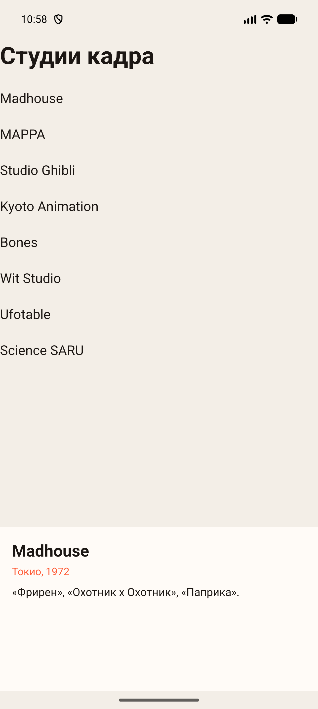
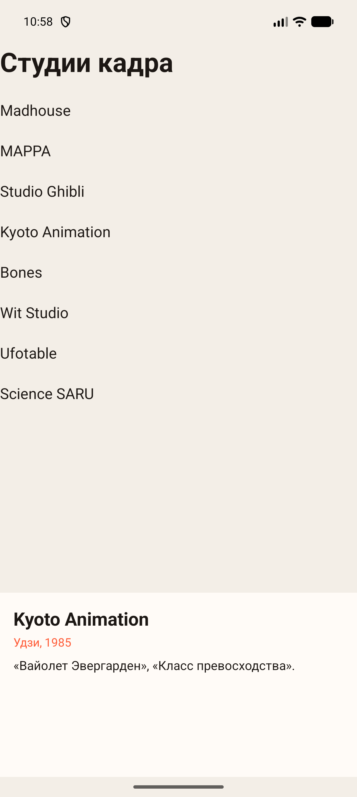
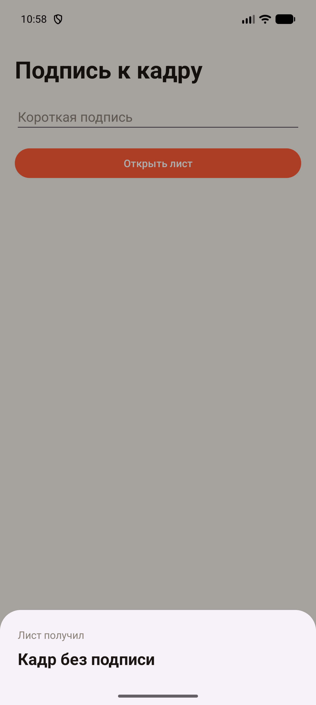
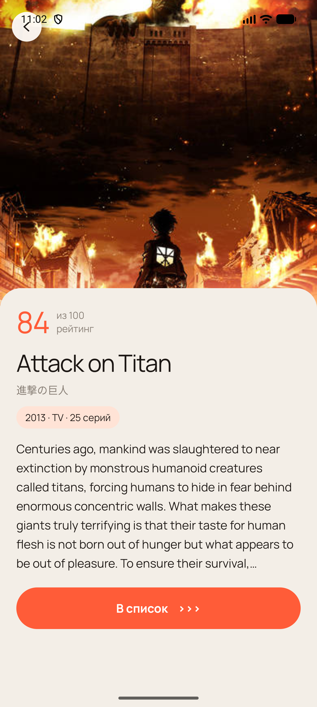
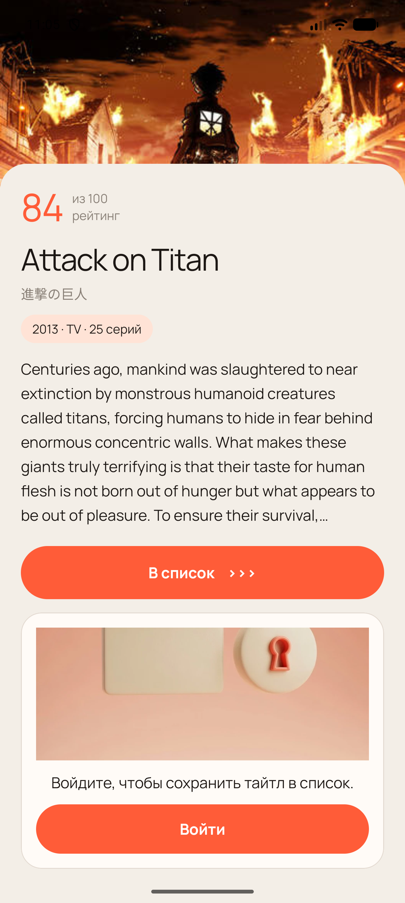
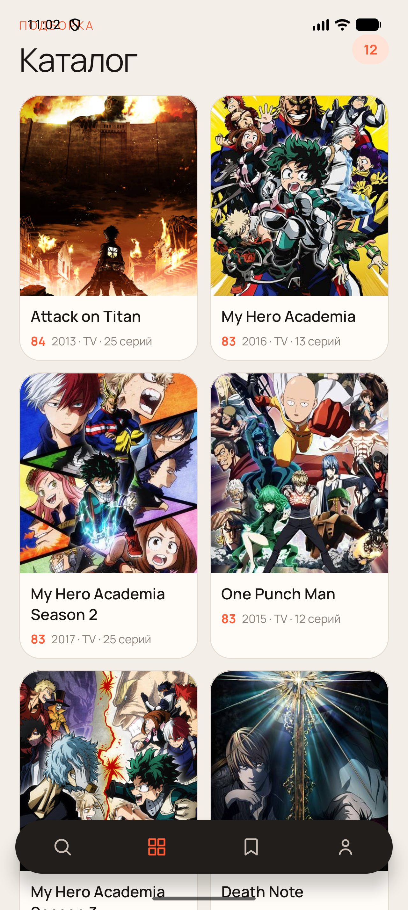
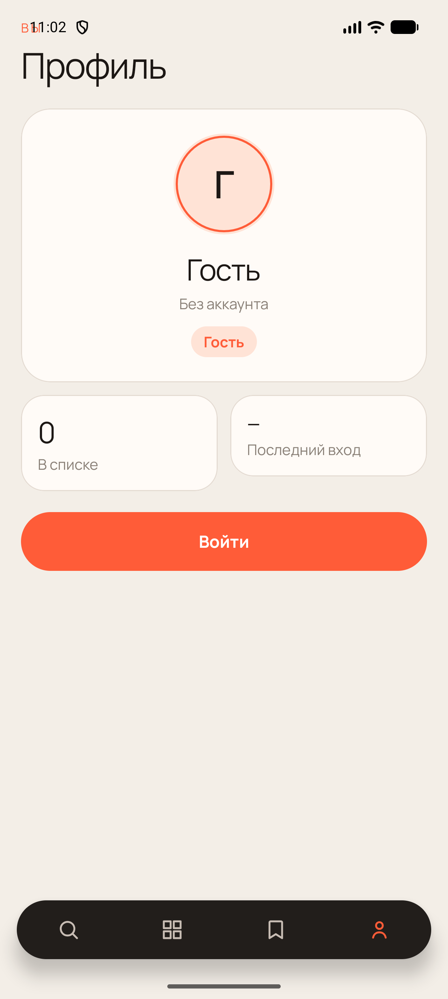

# Практическая работа № 6

Дисциплина «Разработка мобильных приложений». Фрагменты и обмен данными.

**Студент:** Данилов Михаил Алексеевич  
**Группа:** БСБО-09-23  
**Проект:** AniShot, пакет `ru.mirea.danilov.anishot`

---

## Содержание

1. [Цель работы](#1-цель-работы)
2. [Задание](#2-задание)
3. [Список дел](#3-список-дел)
4. [Два фрагмента на одном экране](#4-два-фрагмента-на-одном-экране)
5. [Подпись к кадру](#5-подпись-к-кадру)
6. [Карточка и профиль AniShot](#6-карточка-и-профиль-anishot)
7. [Вывод](#7-вывод)

---

## 1. Цель работы

Вынести экран в отдельный фрагмент и передать ему номер по списку. На одном экране держать список и подробности через общую ViewModel. Разово отдать строку другому фрагменту через Fragment Result API. В AniShot карточка тайтла открывается поверх каталога и кладётся в обратный стек, а профиль собирается из данных входа.

## 2. Задание

1. Модуль FragmentApp: список дел во фрагменте, в аргументах номер по списку.
2. Контейнер без `android:name`. Фрагмент добавляется один раз, при `savedInstanceState == null`, с `setReorderingAllowed(true)`.
3. Модуль FragmentManagerApp: два фрагмента на главном экране. Выбор пункта обновляет подробности.
4. Модуль ResultApiFragmentApp: строка уходит в нижний лист через Fragment Result API.
5. В AniShot список, карточка и профиль живут во фрагментах. Переход на карточку учитывает обратный стек. Профиль читает данные авторизации.

| Пункт | Где сделано |
| --- | --- |
| Список дел | `FragmentApp`, `TaskFragment` |
| Номер по списку | аргумент `my_number_student`, значение 5 |
| Список и подробности | `FragmentManagerApp`, общая `StudioViewModel` |
| Результат фрагмента | `NoteFragment`, `NoteSheet` |
| Карточка в стеке | `HomeActivity.openDetails` |
| Профиль | `ProfileFragment` |

Зависимость фрагментов: `androidx.fragment:fragment:1.8.6`. Пакеты модулей: `ru.mirea.danilov.fragmentapp`, `ru.mirea.danilov.fragmentmanagerapp`, `ru.mirea.danilov.resultapifragmentapp`. Подписи приложений: «Задачи», «Студии», «Подпись».

## 3. Список дел

Активность только ставит фрагмент в контейнер `fragmentContainer`. В разметке у контейнера нет атрибута `android:name`, иначе аргумент не доходит. Третьим аргументом `add` идёт сам `Bundle`, а не пустая ссылка.

**Листинг 1.** Номер по списку уходит во фрагмент один раз

```java
public static final int STUDENT_NUMBER = 5;

if (savedInstanceState == null) {
    Bundle bundle = new Bundle();
    bundle.putInt("my_number_student", STUDENT_NUMBER);
    getSupportFragmentManager().beginTransaction()
            .setReorderingAllowed(true)
            .add(R.id.fragmentContainer, TaskFragment.class, bundle)
            .commit();
}
```

Фрагмент читает аргумент в `onViewCreated` и пишет строку «Номер по списку: 5». Стартовые дела: досмотреть 14 серию «Фрирен», выписать таймкод, сверить студию, собрать полку, пересмотреть «Унесённых призраками». Новая строка из поля добавляется в конец списка, пустое поле не добавляет пункт. Флажок меняет отметку у той же позиции.

**Листинг 2.** Чтение номера

```java
int number = requireArguments().getInt("my_number_student");
((TextView) view.findViewById(R.id.textNumber)).setText("Номер по списку: " + number);
```



## 4. Два фрагмента на одном экране

Модуль «Студии» показывает студии кадра и карточку выбранной студии одновременно. Оба фрагмента объявлены в разметке через `FragmentContainerView` и `android:name`, активность их в коде не добавляет.

**Листинг 3.** Два контейнера на одном экране

```xml
<androidx.fragment.app.FragmentContainerView
    android:id="@+id/studioList"
    android:name="ru.mirea.danilov.fragmentmanagerapp.StudioListFragment"
    android:tag="studios"
    android:layout_width="match_parent"
    android:layout_height="0dp"
    android:layout_weight="1" />

<androidx.fragment.app.FragmentContainerView
    android:id="@+id/studioDetails"
    android:name="ru.mirea.danilov.fragmentmanagerapp.StudioDetailsFragment"
    android:tag="details"
    android:layout_width="match_parent"
    android:layout_height="220dp" />
```

Общая модель берётся у активности, поэтому оба фрагмента видят один и тот же выбор. Если выбора ещё нет, список сам отмечает первую студию, и нижняя карточка не остаётся пустой.

**Листинг 4.** Общая модель выбора

```java
public class StudioViewModel extends ViewModel {
    private final MutableLiveData<Studio> selected = new MutableLiveData<>();

    public void select(Studio studio) {
        selected.setValue(studio);
    }

    public LiveData<Studio> selected() {
        return selected;
    }
}
```

```java
StudioViewModel model = new ViewModelProvider(requireActivity()).get(StudioViewModel.class);
if (model.selected().getValue() == null && !studios.isEmpty()) {
    model.select(studios.get(0));
}
holder.itemView.setOnClickListener(v -> model.select(studio));
```

Карточка наблюдает ту же модель и подставляет название, город с годом и короткую строку о работах. В списке восемь студий: Madhouse, MAPPA, Studio Ghibli, Kyoto Animation, Bones, Wit Studio, Ufotable, Science SARU.





## 5. Подпись к кадру

Модуль «Подпись» передаёт одну строку из формы в нижний лист. Слушатель стоит в `onCreate` листа на родительском `FragmentManager`. Результат кладётся в тот же менеджер до вызова `show`, с ключами `requestKey` и `key`. Пустое поле заменяется строкой «Кадр без подписи». Лист хранит полученный текст в поле и ставит его в `TextView`, когда разметка уже есть.

**Листинг 5.** Отправка и приём подписи

```java
public static final String REQUEST = "requestKey";

String text = edit.getText().toString().trim();
if (text.isEmpty()) {
    text = getString(R.string.empty_note);
}
Bundle bundle = new Bundle();
bundle.putString("key", text);
getParentFragmentManager().setFragmentResult(REQUEST, bundle);
new NoteSheet().show(getParentFragmentManager(), "note");
```

```java
public void onCreate(@Nullable Bundle savedInstanceState) {
    super.onCreate(savedInstanceState);
    getParentFragmentManager().setFragmentResultListener(NoteFragment.REQUEST, this, (key, bundle) -> {
        received = bundle.getString("key", "");
        if (note != null) {
            note.setText(received);
        }
    });
}
```



## 6. Карточка и профиль AniShot

Каталог, поиск, список и профиль остаются фрагментами внутри `HomeActivity`. Постер и кнопка «Открыть карточку» больше не открывают отдельную активность. Карточка заменяет содержимое того же контейнера и попадает в обратный стек под именем `card`. Пока в стеке есть запись, нижняя панель скрыта. Нажатие вкладки сначала снимает карточку, затем ставит нужный раздел. Кнопка «назад» на карточке вызывает `popBackStack`.

**Листинг 6.** Карточка в обратном стеке

```java
public void openDetails(int animeId) {
    getSupportFragmentManager().beginTransaction()
            .setReorderingAllowed(true)
            .setCustomAnimations(R.anim.rise_in, R.anim.fade_out, R.anim.rise_in, R.anim.fade_out)
            .replace(R.id.fragmentContainer, DetailsFragment.newInstance(animeId))
            .addToBackStack("card")
            .commit();
}

private void syncDock() {
    boolean card = getSupportFragmentManager().getBackStackEntryCount() > 0;
    nav.setVisibility(card ? View.GONE : View.VISIBLE);
}
```

`DetailsFragment` раздувает ту же разметку, что была у экрана карточки, и получает номер тайтла аргументом `animeId`. Сохранение идёт через `DetailsViewModel`. Гость не пишет список: появляется карточка с текстом «Войдите, чтобы сохранить тайтл в список.» и кнопкой входа. У вошедшего пользователя успешная запись меняет кнопку на «В списке» и выключает её. Сбой показывает «Не удалось сохранить.»

**Листинг 7.** Ответ на сохранение

```java
if (save.guest) {
    art.setVisibility(View.VISIBLE);
    openAuth.setVisibility(View.VISIBLE);
    status.setText("Войдите, чтобы сохранить тайтл в список.");
} else if (save.saved) {
    art.setVisibility(View.GONE);
    openAuth.setVisibility(View.GONE);
    status.setText("Теперь в вашем списке.");
    add.setText("В списке");
    add.setEnabled(false);
} else {
    art.setVisibility(View.GONE);
    openAuth.setVisibility(View.GONE);
    status.setText("Не удалось сохранить.");
}
```







Профиль — отдельный фрагмент. `ProfileViewModel` отдаёт пользователя и число тайтлов в списке. Для гостя имя «Гость», почта «Без аккаунта», дата «—», значок «Гость», кнопка выхода скрыта. Для вошедшего пользователя видны почта, дата последнего входа, значок «Коллекционер» и выход.



## 7. Вывод

FragmentApp показывает список дел и номер по списку 5. Фрагмент добавляется один раз, контейнер не задаёт класс в разметке. FragmentManagerApp держит список студий и карточку на одном экране: выбор Madhouse виден сразу, нажатие Kyoto Animation меняет нижний блок через общую ViewModel. ResultApiFragmentApp передаёт подпись в нижний лист ключом `requestKey`. В AniShot карточка тайтла лежит в обратном стеке, нижняя панель на ней скрыта, возврат восстанавливает каталог. Профиль собирается из данных входа и для гостя не показывает аккаунт.
