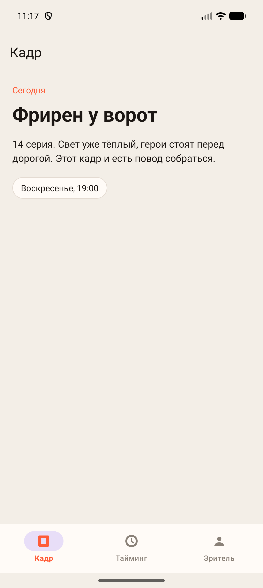
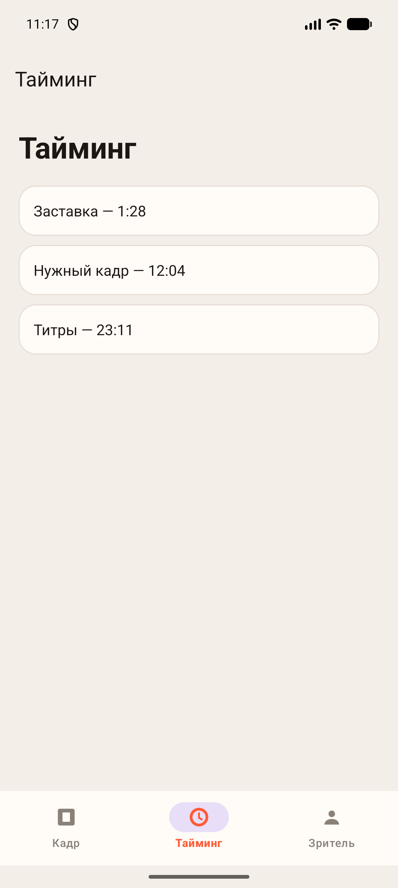
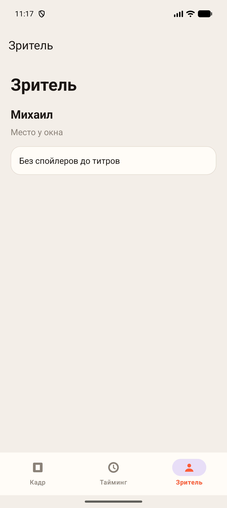
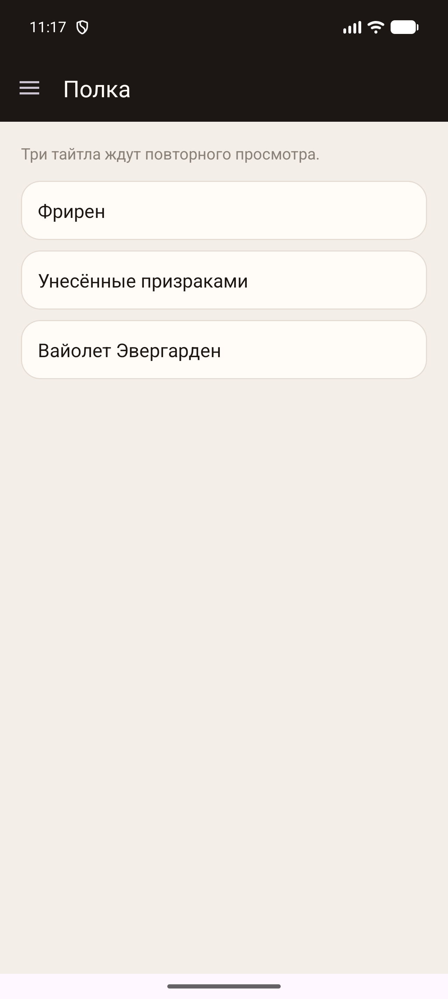
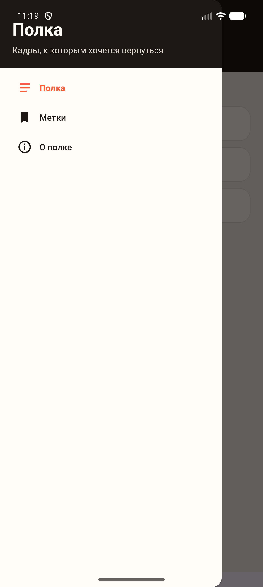
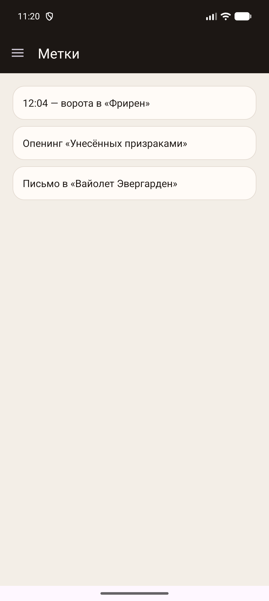
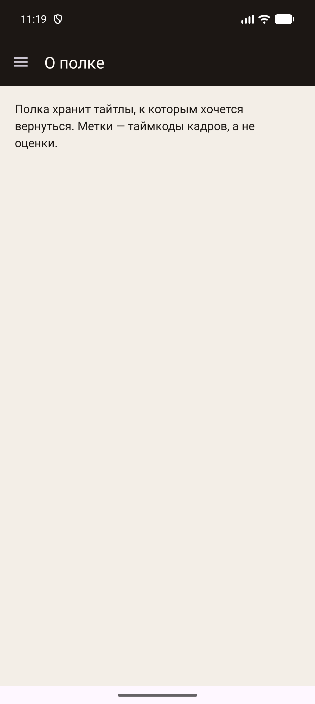
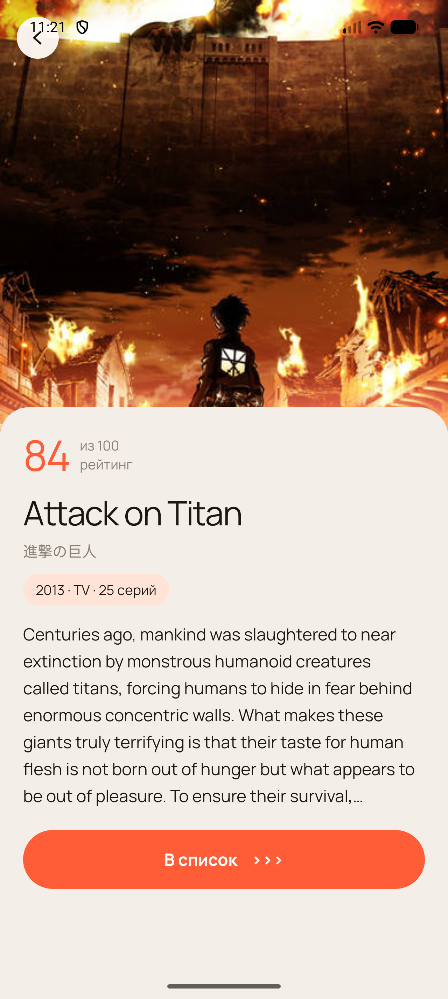
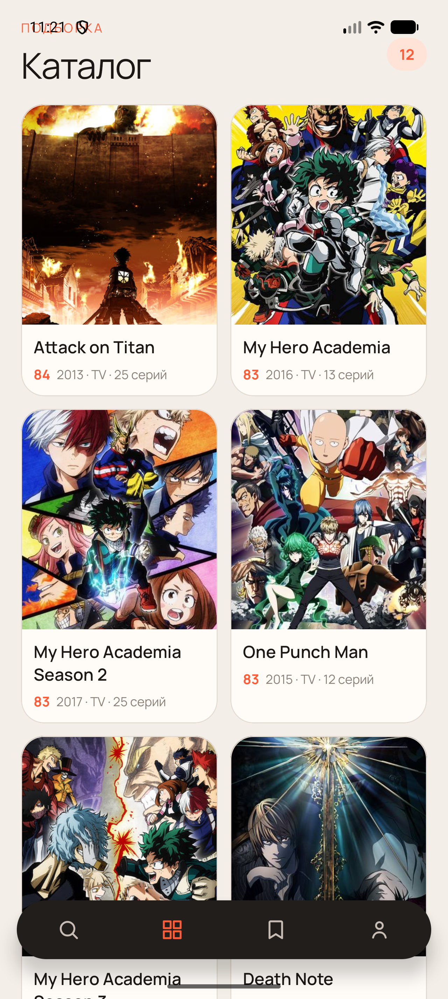
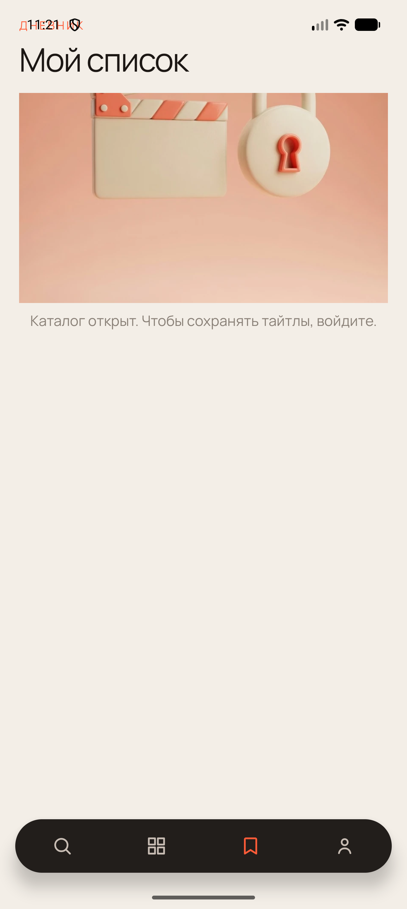

# Практическая работа № 7

Дисциплина «Разработка мобильных приложений». Navigation Component.

**Студент:** Данилов Михаил Алексеевич  
**Группа:** БСБО-09-23  
**Проект:** AniShot, пакет `ru.mirea.danilov.anishot`

---

## Содержание

1. [Цель работы](#1-цель-работы)
2. [Задание](#2-задание)
3. [Сеанс](#3-сеанс)
4. [Полка](#4-полка)
5. [Навигация AniShot](#5-навигация-anishot)
6. [Вывод](#6-вывод)

---

## 1. Цель работы

Собрать переход между экранами через Navigation Component. В отдельных модулях показать нижнюю панель и боковую шторку. В AniShot оставить свою нижнюю панель, а разделы и карточку тайтла вести через граф навигации.

## 2. Задание

1. View Binding в модулях с панелью и шторкой. В AniShot экраны по-прежнему ищутся через `findViewById`.
2. Модуль BottomNavigationApp: своя задумка, иконки, своя палитра, три раздела.
3. Модуль NavigationDrawerApp: своя задумка, своя палитра. Кнопка «назад» закрывает открытую шторку и не уводит из приложения.
4. В AniShot разделы и карточка открываются через `NavHostFragment` и граф. Идентификаторы пунктов совпадают с пунктами назначения.

| Пункт | Где сделано |
| --- | --- |
| View Binding | `Сеанс`, `Полка` |
| Нижняя панель | `BottomNavigationApp` |
| Шторка | `NavigationDrawerApp` |
| Граф AniShot | `res/navigation/home.xml` |
| Карточка | пункт `details`, аргумент `animeId` |

Библиотека `androidx.navigation` версии 2.8.4: `navigation-fragment` и `navigation-ui`. Пакеты: `ru.mirea.danilov.bottomnavigationapp`, `ru.mirea.danilov.navigationdrawerapp`. Подписи приложений: «Сеанс» и «Полка».

Тема без встроенной панели действий. Своя `MaterialToolbar` стоит в разметке, у корня `fitsSystemWindows`, в теме `windowOptOutEdgeToEdgeEnforcement`. Контроллер берётся у `NavHostFragment`, а не вызовом `Navigation.findNavController(activity, id)`: контейнер — `FragmentContainerView`.

## 3. Сеанс

«Сеанс» — короткая запись одного просмотра. Три раздела: «Кадр», «Тайминг», «Зритель». Цвет акцента коралловый `#FF5C38`, фон бумажный `#F3EEE7`. Иконки свои: рамка кадра, часы, человек. Идентификатор пункта меню равен идентификатору фрагмента в графе, поэтому `NavigationUI.setupWithNavController` сам отмечает выбранный раздел.

**Листинг 1.** Привязка разметки и панели

```java
ActivityMainBinding binding = ActivityMainBinding.inflate(getLayoutInflater());
setContentView(binding.getRoot());
AppBarConfiguration appBarConfiguration = new AppBarConfiguration.Builder(
        R.id.navigation_frame,
        R.id.navigation_timing,
        R.id.navigation_viewer).build();
NavHostFragment host = (NavHostFragment) getSupportFragmentManager().findFragmentById(R.id.nav_host);
NavigationUI.setupWithNavController(binding.toolbar, host.getNavController(), appBarConfiguration);
NavigationUI.setupWithNavController(binding.navView, host.getNavController());
```

Фрагмент держит binding только пока жива разметка. В `onDestroyView` ссылка обнуляется.

**Листинг 2.** Экран кадра

```java
binding = FragmentFrameBinding.inflate(inflater, container, false);
binding.textKicker.setText("Сегодня");
binding.textTitle.setText("Фрирен у ворот");
binding.textBody.setText("14 серия. Свет уже тёплый, герои стоят перед дорогой. Этот кадр и есть повод собраться.");
binding.textWhen.setText("Воскресенье, 19:00");
return binding.getRoot();
```

```java
@Override
public void onDestroyView() {
    super.onDestroyView();
    binding = null;
}
```







## 4. Полка

«Полка» — заметки о том, что хочется пересмотреть. Разделы: «Полка», «Метки», «О полке». Панель тёмная, цвет `#1C1714`. Шапка шторки: «Полка» и строка «Кадры, к которым хочется вернуться». Шторка передаётся в `AppBarConfiguration` через `setOpenableLayout`, кнопка «вверх» обрабатывается в `onSupportNavigateUp`.

**Листинг 3.** Шторка и кнопка «назад»

```java
appBarConfiguration = new AppBarConfiguration.Builder(
        R.id.navigation_shelf,
        R.id.navigation_marks,
        R.id.navigation_about)
        .setOpenableLayout(binding.drawerLayout)
        .build();
NavHostFragment host = (NavHostFragment) getSupportFragmentManager().findFragmentById(R.id.nav_host);
NavigationUI.setupWithNavController(binding.toolbar, host.getNavController(), appBarConfiguration);
NavigationUI.setupWithNavController(binding.navView, host.getNavController());
getOnBackPressedDispatcher().addCallback(this, new OnBackPressedCallback(true) {
    @Override
    public void handleOnBackPressed() {
        if (binding.drawerLayout.isDrawerOpen(GravityCompat.START)) {
            binding.drawerLayout.closeDrawer(GravityCompat.START);
            return;
        }
        setEnabled(false);
        getOnBackPressedDispatcher().onBackPressed();
        setEnabled(true);
    }
});
```

Пока шторка открыта, «назад» только её закрывает. Когда она закрыта, тот же жест отдаётся графу: с «Меток» и «О полке» он возвращает на предыдущий раздел, со стартового «Полка» выходит из приложения.









## 5. Навигация AniShot

Нижняя панель AniShot осталась прежней: поиск, каталог, список, профиль. Контейнер теперь `NavHostFragment` с графом `home`. Стартовый пункт — поиск. Имена кнопок панели совпадают с пунктами графа: `nav_search`, `nav_catalog`, `nav_list`, `nav_profile`. Карточка — отдельный пункт `details` с целым аргументом `animeId`.

**Листинг 4.** Пункты графа

```xml
<navigation
    android:id="@+id/home"
    app:startDestination="@id/nav_search">
    <fragment
        android:id="@+id/nav_search"
        android:name="ru.mirea.danilov.anishot.presentation.search.SearchFragment" />
    <fragment
        android:id="@+id/nav_catalog"
        android:name="ru.mirea.danilov.anishot.presentation.catalog.CatalogFragment" />
    <fragment
        android:id="@+id/nav_list"
        android:name="ru.mirea.danilov.anishot.presentation.list.MyListFragment" />
    <fragment
        android:id="@+id/nav_profile"
        android:name="ru.mirea.danilov.anishot.presentation.profile.ProfileFragment" />
    <fragment
        android:id="@+id/details"
        android:name="ru.mirea.danilov.anishot.presentation.details.DetailsFragment">
        <argument
            android:name="animeId"
            android:defaultValue="1"
            app:argType="integer" />
    </fragment>
</navigation>
```

Нажатие вкладки не копит одинаковые экраны. Переход одиночный, состояние раздела сохраняется, стек поднимается до поиска, но сам поиск из стека не выбрасывается.

**Листинг 5.** Вкладка и карточка

```java
private void openTab(int id) {
    NavOptions options = new NavOptions.Builder()
            .setLaunchSingleTop(true)
            .setRestoreState(true)
            .setPopUpTo(R.id.nav_search, false, true)
            .build();
    navController.navigate(id, null, options);
}

public void openDetails(int animeId) {
    Bundle args = new Bundle();
    args.putInt("animeId", animeId);
    NavOptions options = new NavOptions.Builder()
            .setEnterAnim(R.anim.rise_in)
            .setExitAnim(R.anim.fade_out)
            .setPopEnterAnim(R.anim.rise_in)
            .setPopExitAnim(R.anim.fade_out)
            .build();
    navController.navigate(R.id.details, args, options);
}
```

Слушатель пункта назначения прячет панель, пока открыта карточка, и отмечает кнопку текущего раздела. Кнопка «назад» на карточке вызывает `Navigation.findNavController(v).popBackStack()`. Системная «назад» делает то же: карточка уходит, каталог и панель возвращаются. Гостевой список по-прежнему пишет: «Каталог открыт. Чтобы сохранять тайтлы, войдите.»







## 6. Вывод

«Сеанс» переключает кадр, тайминг и зрителя нижней панелью. «Полка» открывает разделы из шторки, а «назад» сначала закрывает шторку. Оба модуля читают разметку через View Binding и обнуляют её вместе с видом. AniShot ведёт четыре раздела и карточку тайтла через один граф. Панель на карточке скрыта, возврат восстанавливает каталог. Гость по-прежнему не наполняет список.
